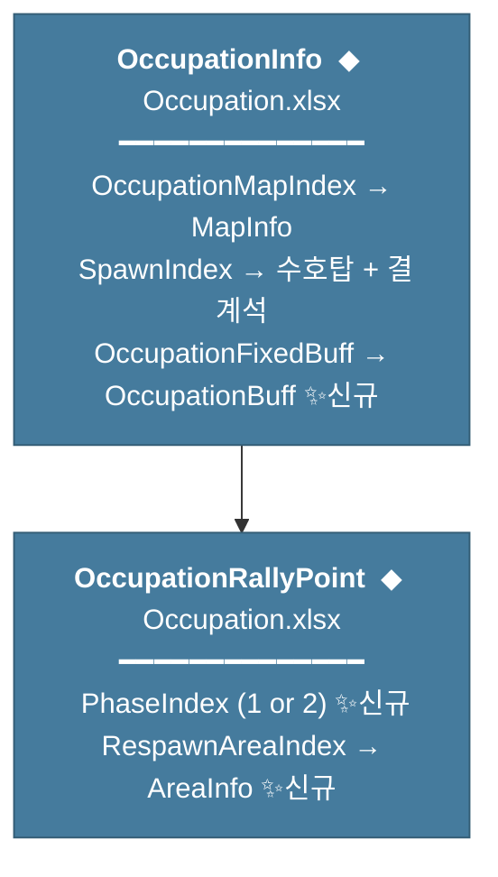
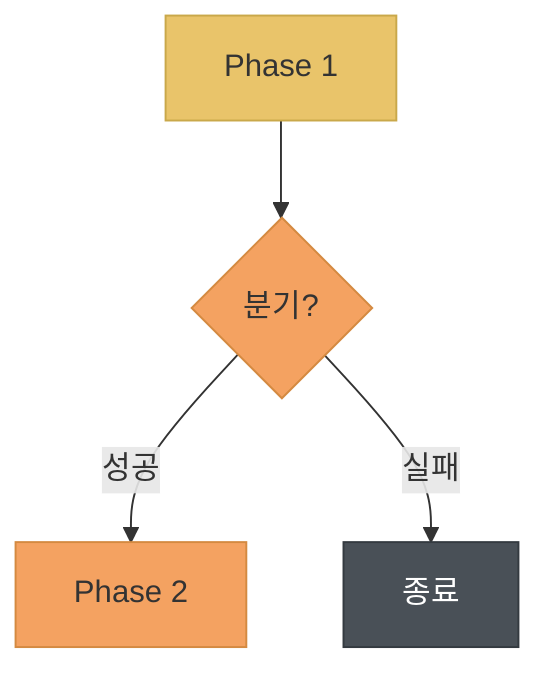
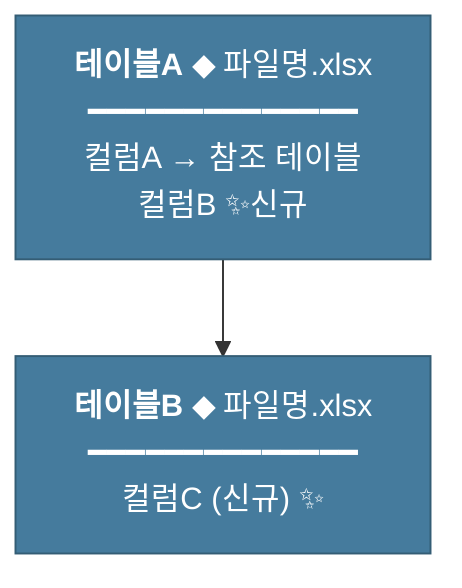

# 기획서 작성 지침

---

## 문서 히스토리

| 버전 | 작성일 | 작성자 | 최근수정일자 | 마지막 수정자 | 상태 |
|------|--------|--------|--------------|---------------|------|
| ver01 ~ 05 | 2025-12-27 | 송지훈 | 2026-03-18 | 송지훈 | 완료 |
| ver06 ~ 10 | 2026-03-19 | 송지훈 | 2026-03-29 | 송지훈 | 완료 |
| ver11 | 2026-03-30 | 송지훈 | 2026-03-30 | 송지훈 | 완료 |
| ver12 | 2026-04-07 | 송지훈 | 2026-04-07 | 송지훈 | 완료 |
| ver13 | 2026-04-10 | 송지훈 | 2026-04-10 | 송지훈 | 진행중 |

**ver01 ~ 05 요약** — 기획서 작성 표준 초안(ver01 ~ 03), 구현 상태/의사결정 표기·주석 태그·Mermaid·시뮬레이션·팀별 작업 규칙 신설(ver04), DataTable 3단 구조·크로스 레퍼런스·담당 이동 버전 관리 규칙 추가(ver05)

**ver06 ~ 10 요약** — 이미지 크로스 레퍼런스·인용 블록 태그(v6), 확인 완료 태그·temp classDef·마일스톤 대비표(v7), 소주제 헤드라인 상태 태그·프로그램팀 사양서 챕터 규칙·DataTable 컬럼 상태 색상(v8), 약어 표기·ASCII 바·월드/NPC 색상 체계(v9), 목차 리스트 형식·세계관 배치 원칙·히스토리 5단위 압축(v10)

---

**목차**

1. 개요
2. 문서 구조
3. 문서 히스토리 관리
4. 서술 규칙
5. 시각 자료 처리
6. 개발목표와 개발방향 작성 규칙
7. 표(Table) 작성 규칙
8. 강조 및 특수 표기 규칙
9. 구현 상태 및 의사결정 표기 규칙
10. 주석(Comment) 태그 체계
11. Mermaid 차트 활용 규칙
12. 시뮬레이션 및 산출 섹션 규칙
13. 팀별 작업 검토 챕터 규칙
14. 문서 파일 네이밍 규칙
15. DataTable 구현 명세 작성 규칙

---

## 1. 개요

### 1.1 개발목표

(1) 기획서 작성 표준화
* 일관된 문서 구조와 서술 방식을 정의하여 작성자 간 편차를 최소화합니다

(2) 협업 효율성 향상
* 명확한 규칙을 통해 문서 검토 및 수정 과정을 간소화합니다

(3) 개발팀 가독성 확보
* 쉬운 용어와 정돈된 형식으로 개발팀의 이해도를 높입니다

(4) 리뷰 회의 가독성 확보
* 구현 상태, 의사결정 항목, 밸런스 검토 사항 등이 시각적으로 구분되어 회의 중 즉시 식별 가능합니다

### 1.2 개발방향

(1) 문서 구조 표준 정의
* 모든 기획서에 동일한 챕터 구성과 말머리 규칙을 적용합니다

(2) 버전 및 상태 관리 체계 수립
* 문서 히스토리를 통해 수정 이력과 진행 상태를 명확히 추적합니다

(3) 용어 표기 가이드 적용
* 어려운 용어는 쉽게 풀어쓰고, 영어 표현은 원어를 병기합니다

(4) 시각적 강조 체계 표준화
* HTML 컬러 태그, 주석 태그, Mermaid 차트의 사용 규칙을 정의하여 문서 전반의 시각적 일관성을 확보합니다

### 1.3 용어 정의

| 용어 | 설명 |
|------|------|
| 말머리 | 문장 앞에 붙는 기호 또는 번호 체계입니다 |
| 페어(Pair) | 서로 대응하는 한 쌍의 관계를 의미합니다 |
| 챕터(Chapter) | 기획서 내 주제별로 구분되는 단위입니다 |

### 1.4 ver04 변경 이력

* ver03 대비 아래 규칙이 **신규 추가**되었습니다

| 신규 챕터 | 내용 |
|---------|------|
| 9장 | 구현 상태 및 의사결정 표기 규칙 (HTML 컬러 태그) |
| 10장 | 주석 태그 체계 (시스템 참조, 밸런스, 개발 확인 등) |
| 11장 | Mermaid 차트 활용 규칙 (방향, classDef 색상 체계) |
| 12장 | 시뮬레이션 및 산출 섹션 규칙 (전제→산출→밸런스 주석) |
| 13장 | 팀별 작업 검토 챕터 규칙 (담당 분류, 비고 컬럼) |

* ver03의 기존 규칙(1~8장, 14장)은 **전량 유지**됩니다
* ver03은 본 문서에 통합되었으므로 **파기**합니다

### 1.5 ver05 변경 이력 <span style="color:#FF4444">(v5 신규)</span>

* ver04 대비 아래 규칙이 **신규 추가 또는 보강**되었습니다
* 점령전 콘텐츠 상세기획서(ver01 ~ ver03) 작업에서 실제 발생한 이슈를 기반으로 정리합니다

| 변경 유형 | 대상 | 내용 |
|---------|------|------|
| **신규** | 15장 | DataTable 구현 명세 작성 규칙 (3단 구조 표준화 + GameString/Enum 등록 패턴) |
| **보강** | 4장 (4.5) | 크로스 레퍼런스 규칙 — 동일 데이터 중복 기술 방지 |
| **보강** | 9장 (9.2) | 구현 상태 태그에 `(제거 검토)` 추가 |
| **보강** | 10장 (10.2) | 주석 태그 파트 지정 변형 허용 규칙 추가 |
| **보강** | 11장 (11.1) | flowchart / erDiagram 선택 가이드라인 추가 |
| **보강** | 13장 (13.4) | 담당 이동 시 버전 관리 규칙 추가 |

* ver04의 기존 규칙(1~14장)은 **전량 유지**됩니다

### 1.6 ver06 변경 이력 <span style="color:#FF4444">(v6 신규)</span>

* ver05 대비 아래 규칙이 **신규 추가 또는 보강**되었습니다
* 점령전 콘텐츠 상세기획서(ver03 ~ ver04) 작업에서 발생한 이슈를 기반으로 정리합니다

| 변경 유형 | 대상 | 내용 |
|---------|------|------|
| **보강** | 2장 (2.3) | 소주제 번호 연속성 규칙 + 3단계 번호 중복 방지 규칙 |
| **신규** | 5장 (5.3) | 이미지 크로스 레퍼런스 규칙 — 동일 이미지 중복 삽입 방지 |
| **신규** | 10장 (10.4) | 인용 블록 형태 태그 규칙 — `> [태그명] — 내용` 표준 형식 |

* ver05의 기존 규칙(1~15장)은 **전량 유지**됩니다

### 1.7 ver07 변경 이력 <span style="color:#FF4444">(v7 신규)</span>

* ver06 대비 아래 규칙이 **보강**되었습니다
* 점령전 콘텐츠 상세기획서(ver05) 작업에서 발생한 이슈를 기반으로 정리합니다

| 변경 유형 | 대상 | 내용 |
|---------|------|------|
| **보강** | 10장 (10.2) | 확인 완료 계열 태그 추가 — `[등록 완료]`, `[서버 확인 완료]`, `[클라 확인 완료]` |
| **보강** | 11장 (11.2) | DataTable 명세 색상에 `temp` classDef 추가 — M(N) 임시 유지, 후속 전환 예정 |
| **보강** | 15장 (15.2) | 테이블별 명세 3단 구조에 선택적 **4단(마일스톤 대비표)** 추가 |

* ver06의 기존 규칙(1~15장)은 **전량 유지**됩니다

### 1.8 ver08 변경 이력 <span style="color:#FF4444">(v8 신규)</span>

* ver07 대비 아래 규칙이 **신규 추가 또는 보강**되었습니다
* 점령전 콘텐츠 상세기획서(ver06) 작업에서 발생한 이슈를 기반으로 정리합니다

| 변경 유형 | 대상 | 내용 |
|---------|------|------|
| **신규** | 9장 (9.3) | 소주제 헤드라인 상태 태그 규칙 — `— (상태)(빌드)` 표기 |
| **보강** | 10장 (10.2) | 서버↔클라이언트 인터페이스 태그 추가 |
| **신규** | 13장 (13.5) | 프로그램팀 전용 사양서 챕터 구성 규칙 |
| **보강** | 15장 (15.2) | DataTable 컬럼 상태 색상 체계 — 유지/신규/변경/컬럼 제거 |

* ver07의 기존 규칙(1~15장)은 **전량 유지**됩니다

### 1.9 ver09 변경 이력 <span style="color:#FF4444">(v9 신규)</span>

* ver08 대비 아래 규칙이 신규 추가되었습니다
* 메인퀘스트 설계 정책(ver03) 폴리싱 과정에서 도출된 보강 항목입니다

| 변경 유형 | 대상 | 내용 |
|---------|------|------|
| 신규 | 4장 (4.6) | 약어 표기 규칙 — 한글 우선, 괄호에 약자 |
| 신규 | 7장 (7.4) | 합계 행 강조 규칙 — 레드 볼드 통일 |
| 신규 | 7장 (7.5) | ASCII 바 시각화 패턴 — ███░░░ 10칸 기준 |
| 신규 | 9장 (9.4) | 월드 색상 코딩 체계 — 5개 월드 + 합계 |
| 신규 | 9장 (9.5) | NPC 등급 색상 체계 — 파트너 · 주연 · 상점 · 조연 |
| 신규 | 11장 (11.2 (6)) | Mermaid 파트별 색상 체계 — 기획 · 원화 · 캐릭터 등 9종 |
| 보강 | 2장 (2.2) | 목차 대분류 그룹핑 방식 추가 |

* ver08의 기존 규칙(1~15장)은 전량 유지됩니다

### 1.10 ver10 변경 이력 <span style="color:#FF4444">(v10 신규)</span>

* ver09 대비 아래 규칙이 신규 추가 또는 보강되었습니다
* 국가 토벌전 콘텐츠 상세기획서(ver01) 작업에서 도출된 보강 항목입니다

| 변경 유형 | 대상 | 내용 |
|---------|------|------|
| 변경 | 2장 (2.2) | 목차 대분류 그룹핑 — 표 형식 폐기, 리스트 기본 |
| 신규 | 2장 (2.4) | 세계관 및 비주얼 설정 배치 원칙 |
| 보강 | 3장 (3.2) | 복수 담당자 표기 허용 |
| 신규 | 3장 (3.4) | 히스토리 5단위 압축 규칙 |

* ver09의 기존 규칙(1~15장)은 전량 유지됩니다

### 1.11 ver11 변경 이력 <span style="color:#FF4444">(v11 신규)</span>

* ver10 대비 아래 규칙이 보강되었습니다
* 기획서 작성 지침 자체 문서의 마크다운 렌더링 이슈에서 도출된 보강 항목입니다

| 변경 유형 | 대상 | 내용 |
|---------|------|------|
| 보강 | 2장 (2.3) | 5단계(->) 마크다운 렌더링 규칙 — 4칸 들여쓰기 + 빈 줄 필수 |

* ver10의 기존 규칙(1~15장)은 전량 유지됩니다

### 1.12 ver12 변경 이력 <span style="color:#FF4444">(v12 신규)</span>

* ver11 대비 아래 규칙이 신규 추가 또는 보강되었습니다
* 점령전 콘텐츠 상세기획서(ver09) 작업 및 프로젝트 지식 관리 이슈에서 도출된 보강 항목입니다

| 변경 유형 | 대상 | 내용 |
|---------|------|------|
| 보강 | 3장 (3.3) | 문서 상태에 "아카이브" 추가 — 3단계 상태 체계 |
| 신규 | 3장 (3.5) | 사내테스트 피드백 반영 규칙 — 피드백 일자 명기, 담당 분류, 추적 위치 |
| 변경 | 14장 (14.2) | 파일명 버전 표기 — 기존 "버전 미포함" 규칙 폐기, 접미어 표준 + 교체 절차 신설 |

* ver11의 기존 규칙(1~15장)은 전량 유지됩니다

### 1.13 ver13 변경 이력 <span style="color:#FF4444">(v13 신규)</span>

* ver12 대비 아래 규칙이 신규 추가 또는 보강되었습니다
* 국가 토벌전 상세기획서, 메인퀘스트 작업 지침 v4, 의뢰퀘스트 정책 v3 등 복수 문서 작업에서 도출된 보강 항목입니다

| 변경 유형 | 대상 | 내용 |
|---------|------|------|
| 신규 | 8장 (8.3) | 서식 적용 범위 — md 기획서 산출물 전용 vs 채팅 피드백 구분 |
| 보강 | 9장 (9.4) | 헬헤임 월드 색상 변경 — `#2E7D32` → `#9966CC` (밝은 보라) |
| 보강 | 11장 (11.1) | xychart-beta 지양 규칙 + chart 코드 블록 크로스 레퍼런스 추가 |
| 보강 | 11장 (11.2) | 서버/전장 구분 classDef 2건 추가 (battle, highlight) + decision 색상 변경 |
| 신규 | 11장 (11.4) | Mermaid 작성 주의사항 — subgraph 이모지 금지, 구분선 패턴, 노드 분리 가이드 |

* ver12의 기존 규칙(1~15장)은 전량 유지됩니다

---

## 2. 문서 구조

### 2.1 기본 구성

(1) 필수 포함 항목
* 문서 히스토리는 개요 최상단에 고정 배치합니다
* 목차는 문서 히스토리 바로 아래에 배치합니다
* 개발목표와 개발방향은 개요에 반드시 포함합니다
* 용어 정의는 개요 앞에 독립 챕터(0장)로 배치합니다
* 용어 정의의 각 항목은 ### 섹션으로 분리하여 용어별 설명을 기술합니다

(2) 챕터 구성 순서
* 개요 이후 메인 챕터는 주제 단위로 구성합니다
* 각 메인 챕터는 독립적인 내용을 다룹니다

### 2.2 목차 규칙

(1) 목차 위치
* 문서 히스토리 바로 아래에 배치합니다

(2) 작성 형식
* 번호와 챕터명을 나열합니다
* 앵커 링크는 사용하지 않으며, 번호와 챕터명만 기재합니다

(3) 작성 예시

```
**목차**

1. 개요
2. 챕터명
3. 챕터명
```

(4) 하위 목차
* 챕터 내부에 소주제가 많은 경우, 해당 챕터 시작부에 하위 목차를 별도로 작성할 수 있습니다
* 하위 목차 역시 앵커 링크 없이 번호와 소주제명만 기재합니다

(5) 대분류 그룹핑 <span style="color:#FF4444">(v10 변경)</span>

* 목차는 번호와 챕터명만 나열하는 리스트 형식을 기본으로 합니다
* 챕터 수가 많더라도 표 형식으로 목차를 구성하지 않습니다
* 챕터명 자체로 성격이 구분되도록 헤드라인을 작성하며, 별도 분류 컬럼은 사용하지 않습니다

-> v9에서 허용했던 '분류' 컬럼 표 형식은 폐기합니다

작성 예시

```
**목차**

1. 개요
2. 콘텐츠 네러티브
3. 플레이 사이클
4. 레벨 설계
5. 몬스터 배치
```

### 2.3 말머리 단계 규칙

(1) 단계별 표기 방식

| 단계 | 표기 | 용도 | 마크다운 문법 |
|------|------|------|---------------|
| 1단계 | 1. 2. 3. | 대주제 | ## 1. 대주제명 |
| 2단계 | 1.1 1.2 1.3 | 소주제 | ### 1.1 소주제명 |
| 3단계 | (1) (2) (3) | 소주제 헤드라인 | 본문에 직접 기재 |
| 4단계 | * 또는 - | 상세내용 | 본문에 직접 기재 |
| 5단계 | -> | 4단계 하위 보충 설명 | 본문에 직접 기재 |

(2) 적용 원칙
* 5단계(->)는 4단계 항목의 하위 설명이 필요한 경우에만 사용합니다
* 5단계를 초과하는 깊이는 지양합니다
* 5단계가 과도하게 반복되는 경우, 내용을 3단계 소주제로 분리하는 것을 검토합니다

(3) 말머리 기호 통일
* 4단계 상세내용 나열 시 별표(*)와 하이픈(-)을 모두 사용할 수 있습니다
* 하나의 문서 내에서는 하나의 기호로 통일하는 것을 권장합니다
* 5단계 보충 설명은 화살표(->)만 사용합니다

(4) 들여쓰기 원칙
* 5단계(->)는 4단계(* 또는 -)보다 한 단계 들여쓰기하여 상하위 관계를 시각적으로 구분합니다
* 동일 단계의 항목은 동일한 들여쓰기 깊이를 유지합니다

(5) 5단계(->) 마크다운 렌더링 규칙 <span style="color:#FF4444">(v11 신규)</span>

* 5단계(->)는 반드시 4칸 스페이스로 들여쓰기합니다
* 4단계(*) 항목과 5단계(->) 항목 사이에 빈 줄 1개를 삽입합니다
* 5단계(->) 항목끼리도 사이에 빈 줄 1개를 삽입합니다
* 이 규칙을 지키지 않으면 Markdown Preview Enhanced 뷰어에서 5단계(->) 항목이 4단계(*) 항목과 같은 줄에 이어 붙여지거나, 들여쓰기가 무시되어 좌측 정렬됩니다

(6) 적용 예시 (v11 갱신)

잘못된 예시 (렌더링 깨짐)

```
* 월드 몬스터 설계 규칙을 표준화합니다
-> 유니크 개체와 베리에이션 분류 기준을 정의합니다
-> 이동속도, 공격범위 등 기본 스펙 상수를 정의합니다
```

-> 빈 줄 없이 이어 붙이면, 뷰어가 ->를 * 의 연속 텍스트로 인식하여 한 줄로 합칩니다

올바른 예시

```
* 월드 몬스터 설계 규칙을 표준화합니다

    -> 유니크 개체와 베리에이션 분류 기준을 정의합니다

    -> 이동속도, 공격범위 등 기본 스펙 상수를 정의합니다

* 리소스 양산 구조와 제작 공정 효율을 향상시킵니다
```

-> 4칸 들여쓰기 + 빈 줄로 마크다운이 리스트 아이템 내부의 하위 문단으로 인식합니다

(7) 소주제 번호 연속성 <span style="color:#FF4444">(v6 신규)</span>
* 2단계(### N.N) 소주제 번호는 **연속**으로 부여합니다
* 중간 삭제로 번호가 비는 경우 후속 번호를 **재정렬**합니다

(8) 3단계 번호 중복 방지 <span style="color:#FF4444">(v6 신규)</span>
* 동일 소주제(### N.N) 내의 3단계 번호 (1)(2)(3)...은 **중복 없이 순차 부여**합니다
* 항목 추가 시 기존 번호 뒤에 이어서 부여합니다

### 2.4 세계관 및 비주얼 설정 배치 원칙 <span style="color:#FF4444">(v10 신규)</span>

(1) 기본 원칙
* 콘텐츠의 세계관, 네러티브, 비주얼 톤 앤 매너 등 설정 관련 상세는 실무 챕터(레벨 설계, 몬스터 배치 등)에 배치합니다
* 개요 챕터에서는 콘텐츠 명칭의 유래와 설계 의도만 짧게 요약합니다

(2) 적용 근거
* 의사결정자(VP)는 설정 상세보다 시스템 구조, 보상 설계, 핵심 수치에 집중합니다
* 세계관과 비주얼 톤은 아트팀, 설정 디자이너 등 실무 담당자가 숙지해야 하는 영역이므로, 해당 담당자가 참조하는 챕터에 배치하는 것이 효율적입니다

(3) 작성 예시

* 개요에서의 배치

-> "발그린드(Valgrind)는 북유럽 신화에서 '전사자의 문'을 뜻하며, 아스가르드 관문 상공에 부유하는 차원 경계 공간으로 각색합니다"

* 레벨 설계 챕터에서의 배치

-> 세계관 배경, 비주얼 키워드, 톤 앤 매너, 몬스터 재등장 설정 등 상세를 해당 챕터의 소주제로 기술합니다

---

## 3. 문서 히스토리 관리

### 3.1 버전 규칙

(1) 버전 표기
* 최초 작성 시 ver01부터 시작합니다
* 수정 또는 갱신이 발생할 때마다 버전을 +1 합니다

(2) 작성자 <span style="color:#FF4444">(v10 보강)</span>
* 작성자는 해당 문서의 기획 담당자로 기재합니다
* 복수의 담당자가 참여한 경우, 쉼표로 구분하여 모두 기재합니다

(3) 히스토리 누적
* 문서 히스토리 테이블에는 모든 버전의 이력을 누적하여 기록합니다
* 이전 버전의 행을 삭제하지 않습니다

### 3.2 히스토리 항목

(1) 필수 항목

| 항목 | 설명 |
|------|------|
| 버전 | 문서 버전 (ver01, ver02, ...) |
| 작성일 | 최초 작성 일자 |
| 작성자 | 최초 작성자 |
| 최근수정일자 | 마지막 수정 일자 |
| 마지막 수정자 | 마지막으로 수정한 담당자 |
| 상태 | 진행중, 완료, 또는 아카이브 |

### 3.3 문서 상태

(1) 상태 구분

| 상태 | 조건 |
|------|------|
| 진행중 | 작성 중이거나 검토 중인 문서입니다 |
| 완료 | 컨펌이 끝난 문서입니다 |
| 아카이브 | 더 이상 갱신하지 않는 문서입니다 <span style="color:#FF4444">(v12 신규)</span> |

(2) 상태 전환 규칙
* 컨펌이 완료되면 "완료"로 변경합니다
* 완료 후 추가 수정이 발생하면 "진행중"으로 교정합니다
* 아카이브 전환 기준을 충족하면 "아카이브"로 변경합니다 <span style="color:#FF4444">(v12 신규)</span>

(3) 아카이브 전환 기준 <span style="color:#FF4444">(v12 신규)</span>

| 문서 유형 | 아카이브 시점 |
|---|---|
| 작업 히스토리 | 신버전 히스토리가 프로젝트 지식에 등록된 시점 |
| 분석 리포트 | 분석 결과가 기획서 본체에 흡수 완료된 시점 |
| 초안/드래프트 | 정식 버전이 확정된 시점 |

(4) 아카이브 처리 규칙 <span style="color:#FF4444">(v12 신규)</span>
* 아카이브 전환 시 히스토리 테이블 상태란에 "아카이브"를 기재합니다
* 프로젝트 지식에서 제거 후에도 로컬 보관은 유지합니다

| 상태 | 프로젝트 지식 |
|---|---|
| 진행중 | 유지 |
| 완료 | 유지 |
| 아카이브 | 제거 대상 |

### 3.4 히스토리 5단위 압축 규칙 <span style="color:#FF4444">(v10 신규)</span>

(1) 압축 단위
* 5개 버전 단위로 1행으로 압축합니다
* 작성일은 해당 구간의 최초 작성일, 최근수정일자는 마지막 수정일을 기재합니다

(2) 압축 시점
* ver05 완료 시점에 ver01 ~ 05를 1행으로 압축합니다
* 현재 작업 중인 버전은 항상 개별 행으로 유지합니다

(3) 요약 기재
* 압축 구간에 대해 히스토리 테이블 아래에 한 줄 요약을 작성합니다
* 주요 변경 사항을 나열하되 3줄을 초과하지 않습니다

(4) 상태 표기
* 압축 구간은 전량 "완료"입니다
* 완료되지 않은 버전은 압축 대상이 아닙니다

(5) 복수 담당자
* 압축 구간 내에 복수의 담당자가 존재하는 경우, 작성자와 마지막 수정자를 쉼표로 구분하여 그대로 기재합니다

(6) 작성 예시

```
## 문서 히스토리

| 버전 | 작성일 | 작성자 | 최근수정일자 | 마지막 수정자 | 상태 |
|------|--------|--------|--------------|---------------|------|
| ver01 ~ 05 | 2026-03-29 | 송지훈, 성준석 | 2026-04-10 | 송지훈 | 완료 |
| ver06 ~ 10 | 2026-04-12 | 송지훈 | 2026-04-25 | 송지훈 | 완료 |
| ver11 | 2026-04-28 | 송지훈 | 2026-04-28 | 송지훈 | 진행중 |

**ver01 ~ 05 요약** — 초안 작성, 맵 구조 확정, 보상 분배 비율 가안, 서버팀 1차 피드백 반영, DataTable 신규 명세 작성

**ver06 ~ 10 요약** — 서버/클라 개발 명세 분리, 통로 규격 조정, 밸런스파트 검토 항목 추가, 기획서 작성 지침 v10 반영
```

### 3.5 사내테스트 피드백 반영 규칙 <span style="color:#FF4444">(v12 신규)</span>

(1) 피드백 반영 원칙
* 피드백 수신 시 기획서 문서 히스토리에 피드백 일자를 명기합니다

    -> 예시 "04/02 사내테스트 피드백 6건 반영"

* 각 피드백 항목을 기획서 대상 챕터에 반영할 때 <span style="color:#FF4444">(ver{NN} 추가)</span> 태그를 부착합니다

(2) 담당 분류

| 분류 | 반영 방식 |
|---|---|
| 콘텐츠 담당 (즉시) | 해당 챕터에 스펙 변경 직접 반영 |
| 시스템/서버/클라 담당 (대기) | 후속 개발 섹션 + 마일스톤 대비 사항에 예정 항목으로 기록 |

(3) 피드백 추적 위치

| 위치 | 역할 |
|---|---|
| 문서 히스토리 ver{NN} 주요 변경 | 피드백 건수 + 요약 |
| 해당 챕터 본문 | 상세 스펙 변경 (ver{NN} 추가 태그) |
| 후속 개발 섹션 | 이관 항목 요약 |
| 마일스톤 대비 사항 | DataTable/서버 영향 있는 항목 상세 |

---

## 4. 서술 규칙

### 4.1 문장 작성

(1) 문장체
* ~합니다 체로 깔끔하게 마무리합니다
* ~음, ~슴 체는 사용하지 않습니다

(2) 구분자 사용
* 콜론(:)은 사용하지 않습니다
* 내용 구분은 줄바꿈으로 처리합니다

(3) 중복 서술 금지
* 앞서 언급한 내용은 반복하지 않습니다
* 참조가 필요한 경우 해당 챕터를 안내합니다

(4) 괄호 표기
* 부가 설명이나 약어 병기 시 소괄호를 사용합니다
* 소괄호 안에 다시 괄호가 필요한 경우는 문장을 분리합니다

### 4.2 용어 표기

(1) 기본 원칙
* 어려운 용어는 쉬운 표현으로 풀어씁니다
* 개발팀이 이해하기 쉬운 용어를 우선 사용합니다

(2) 영어 표기
* 영어 표현은 괄호 안에 원어를 병기합니다
* 예시 형태는 "쉬운표현(English)"입니다

(3) 기술 용어 일관성
* 동일 개념에 대해 문서 전체에서 같은 용어를 사용합니다
* 최초 등장 시 용어 정의를 제공한 후, 이후에는 정의 없이 사용합니다

### 4.3 참고 블록

(1) 사용 시점
* 가이드라인과 다른 특화 설계를 설명할 때 사용합니다
* 부가 설명이나 주의사항을 강조할 때 사용합니다

(2) 작성 형식
* 인용 블록(>)과 굵은 글씨(**참고**)를 조합하여 작성합니다
* 영문 표기(**Note**)는 사용하지 않으며 한글로 통일합니다

(3) 작성 예시

```
> **참고** 일반 가이드라인에서는 10m로 권장하나, 본 문서에서는 학습 단계를 고려하여 17m로 설정합니다.
```

### 4.4 예외 처리

(1) 서술 방식
* 예외 상황 및 분기 케이스는 서술형으로 정리합니다
* 별도의 기호나 형식을 사용하지 않습니다

### 4.5 크로스 레퍼런스 규칙 <span style="color:#FF4444">(v5 신규)</span>

(1) 기본 원칙
* 동일한 데이터(수치, 컬럼 정의, 설계값 등)를 **2곳 이상의 챕터에서 기술하지 않습니다**
* 상세 내용은 **1곳에만** 작성하고, 나머지 위치에서는 **(N장 참조)** 또는 **(N.N 참조)** 링크로 위임합니다

(2) 적용 대상
* DataTable 컬럼 값이 콘텐츠 개요 챕터와 DataTable 명세 챕터에서 동시에 기술되는 경우
* 밸런스 수치가 전투 규칙 챕터와 밸런스 검토 챕터에서 동시에 기술되는 경우
* 시스템 기획서와 콘텐츠 기획서 간에 동일 값이 등장하는 경우

(3) 정본(正本) 우선순위
* DataTable 컬럼 값의 정본은 **DataTable 명세 챕터**입니다
* 콘텐츠 개요, 전투 규칙 등 앞선 챕터에서는 설계 의도와 개요만 기술하고, 구체적인 값은 "(9장 참조)" 등으로 안내합니다

(4) 작성 예시

```
* DataTable 컬럼 정의 및 리뉴얼 상세는 **9장(콘텐츠 DataTable 리뉴얼 명세)**에서 다룹니다. 본 장은 콘텐츠에서 제공하는 값의 개요입니다.
```

```
| OccupationReadyTime | 10분 | (9.4 참조) |
```

(5) 예외
* 개요 챕터에서 핵심 설계값(전투 시간 15분, 참여 인원 50명 등)을 한눈에 요약하는 표는 중복 기술로 보지 않습니다
* 단, 이 경우에도 "상세 조건은 N장 참조"를 표 하단에 명시합니다

### 4.6 약어 표기 규칙 <span style="color:#FF4444">(v9 신규)</span>

(1) 기본 원칙
* 영문 약어를 사용할 때는 한글 의미를 먼저 쓰고, 괄호 안에 약자를 표기합니다
* 동일 문서 내에서 최초 등장 시 한글 + 약자를 병기하고, 이후에는 약자만 사용할 수 있습니다

(2) 작성 예시

```
* 몬스터 1마리당 처치 시간 (MTKT) 약 4초
* 플레이어 생애 주기 (PLC)를 조절합니다
```

(3) 잘못된 예시

```
* MTKT 약 4초           ← 한글 의미 없이 약자만 사용
* PLC를 조절합니다       ← 첫 등장에서 한글 병기 누락
```

---

## 5. 시각 자료 처리

### 5.1 작업 분담

(1) 기획서 작성 단계
* 차트, 표, 이미지가 필요한 위치에 주석으로 코멘트를 남깁니다
* 실제 시각 자료는 포함하지 않습니다

(2) Excel 이관 단계
* 작성자가 직접 차트, 표, 서식을 디자인하여 보강합니다

### 5.2 이미지 삽입

(1) 마크다운 이미지 문법
* 이미지가 필요한 위치에 마크다운 이미지 문법을 사용합니다
* 대체 텍스트(alt)에는 이미지의 내용을 간결하게 기재합니다

(2) 이미지 파일 관리
* 이미지 파일은 문서와 동일 경로의 images 폴더에 저장합니다
* 상대 경로를 사용하여 참조합니다

(3) 이미지 삽입 주석 (상세 기술)
* 이미지 삽입 위치에는 **파일명 + 설명**을 기재합니다
* 비교 이미지(before/after)는 좌/우를 구분하여 명시합니다
* 이미지에 표기되어야 할 항목이 있으면 리스트로 기재합니다

(4) 작성 예시

```
<!-- [이미지 삽입] 파일명.png (좌: 현재 레이아웃 / 우: 리뉴얼 레이아웃 — 부활 포인트 변경, 진입로 신설 표기) -->
```

```

```

### 5.3 이미지 크로스 레퍼런스 <span style="color:#FF4444">(v6 신규)</span>

(1) 기본 원칙
* 동일 이미지는 **1곳에만** 삽입하고, 나머지 위치에서는 **(N.N 이미지 참조)** 처리합니다
* 4.5 크로스 레퍼런스 규칙의 데이터 중복 방지 원칙을 이미지에도 동일하게 적용합니다

(2) 정본 위치 우선순위
* 이미지의 정본은 **상세 설명이 있는 챕터**에 배치합니다
* 개요/레퍼런스 모음 챕터보다 해당 이미지가 맥락에 밀접한 위치를 우선합니다

(3) 작성 예시

```
* 현재 포탈 형태 이펙트를 FX_A_SafetyZone001_NS 바닥 이펙트로 교체합니다 (이미지는 8.5 (3) 참조)
```

---

## 6. 개발목표와 개발방향 작성 규칙

### 6.1 개발목표

(1) 작성 원칙
* 최소 3개 내외로 목표를 압축하여 설정합니다
* 핵심 의도가 명확히 드러나도록 작성합니다

(2) 표현 방식
* 간결하고 명확한 문장으로 작성합니다
* 측정 가능한 형태로 기술하면 더욱 좋습니다

### 6.2 개발방향

(1) 작성 원칙
* 개발목표와 1:1로 대응하는 페어(Pair) 구조로 작성합니다
* 목표 달성을 위한 구체적인 방향을 제시합니다

(2) 대응 관계
* 개발목표 (1)에는 개발방향 (1)이 대응합니다
* 순서와 맥락이 일치하도록 작성합니다

(3) 추가 항목 허용
* 개발목표와 1:1 대응하지 않는 독립 항목(일정 제안, 엠블렘 등)을 개발방향에 추가할 수 있습니다
* 이 경우 목표 페어 이후에 배치하여 구분합니다

---

## 7. 표(Table) 작성 규칙

### 7.1 표 사용 기준

(1) 사용 시점
* 항목 간 비교, 수치 데이터, 파라미터 정의 등 구조화된 정보를 전달할 때 사용합니다
* 단순 나열은 말머리로 처리하고, 2개 이상의 속성을 가진 항목이 반복될 때 표를 사용합니다

(2) 지양 사항
* 셀 내부에 다단 구조나 목록을 중첩하지 않습니다
* 셀 내용이 3줄을 초과할 경우 표 외부로 분리하여 서술합니다

### 7.2 작성 형식

(1) 헤더 구성
* 첫 번째 행은 반드시 헤더로 작성합니다
* 헤더 행 아래에 구분선(|------|)을 배치합니다

(2) 셀 내용 작성
* 셀 내용은 간결하게 작성합니다
* 셀 내부에서 줄바꿈이 필요한 경우 <br> 태그를 사용합니다

(3) 작성 예시

```
| 항목 | 기본값 | 설명 |
|------|--------|------|
| Spawn Range | 50m x 50m | 섹터 전체를 커버하는 스폰 범위입니다 |
| Spawn Count | 20 | 섹터당 동시 유지되는 몬스터 수입니다 |
```

### 7.3 표 전후 맥락

(1) 표 도입부
* 표 바로 위에 해당 표가 무엇을 설명하는지 한 문장으로 안내합니다

(2) 표 후속 설명
* 표만으로 전달이 부족한 경우, 표 아래에 보충 설명을 서술형으로 작성합니다

### 7.4 합계 행 강조 규칙 <span style="color:#FF4444">(v9 신규)</span>

(1) 기본 원칙
* 표에서 합계 · 총량 행은 레드 볼드로 통일하여 스크롤 중에도 즉시 식별되도록 합니다

(2) 작성 형식

```
| <span style="color:#FF4444">**합계**</span> | <span style="color:#FF4444">**142**</span> | |
```

(3) 적용 범위
* 수량 산출 표, 리소스 총량 표, 월드 합산 표 등 합계가 존재하는 모든 표에 적용합니다

### 7.5 ASCII 바 시각화 패턴 <span style="color:#FF4444">(v9 신규)</span>

(1) 사용 시점
* 표 안에서 수치의 상대적 스케일을 직관적으로 보여줄 때 사용합니다
* Mermaid 차트를 쓸 만큼 복잡하지 않으나, 숫자만으로는 비교가 어려운 경우에 적합합니다

(2) 작성 형식
* 전체 10칸(█ + ░) 기준으로 비율을 표현합니다
* 해당 행의 컬러를 span 태그로 적용합니다

```
| <span style="color:#66BB6A">██░░░░░░░░</span> 약 1 ~ 2h |
| <span style="color:#D4380D">██████░░░░</span> 약 8 ~ 12h |
| <span style="color:#E9C46A">██████████</span> 약 15 ~ 20h |
```

---

## 8. 강조 및 특수 표기 규칙

### 8.1 굵은 글씨(Bold)

(1) 사용 기준
* 핵심 수치, 핵심 키워드, 정책명 등 독자가 빠르게 인지해야 하는 요소에 사용합니다
* 문장 전체를 굵게 처리하지 않으며, 핵심 단어 또는 짧은 구(句) 단위로 적용합니다

(2) 작성 예시

```
* 월드 전체 몬스터 종수는 **60종**으로 설정합니다
* **1Hit = 1Motion** 정책을 원칙으로 합니다
```

### 8.2 주의 표기(!!)

(1) 사용 기준
* 작업자가 반드시 유의해야 하는 사항을 별도로 강조할 때 사용합니다
* 일반 서술과 구분하기 위해 행 앞에 느낌표 두 개(!!)를 붙여 작성합니다

(2) 사용 범위
* 정책 위반 시 리스크가 발생하는 항목, 또는 기존 관행과 다른 규칙을 안내할 때 사용합니다
* 과도한 사용은 강조 효과를 떨어뜨리므로 챕터당 1~2회 이내로 제한합니다

(3) 작성 예시

```
!! Walk / Run Speed의 경우, 애니메이션 제작 시점부터 정책 값을 참고하여 제작하므로 후속 튜닝 비용이 크게 절감됩니다.
```

### 8.3 서식 적용 범위 <span style="color:#FF4444">(v13 신규)</span>

(1) 기본 원칙
* HTML 컬러 태그, 이모지, ASCII 바, chart 코드 블록 등 시각적 서식은 md 기획서 산출물 작성 시에만 적용합니다
* 일반 채팅 피드백(리뷰 코멘트, 분석 요약, 작업 방향 논의 등)에서는 적용하지 않습니다

(2) 적용 대상 구분

| 서식 | md 기획서 산출물 | 채팅 피드백 |
|------|---|---|
| HTML 컬러 태그 (`<span style="color:...">`) | 적용 | 사용 금지 |
| 이모지 마커 | 적용 | 사용 금지 |
| 월드/NPC 등급 컬러 코딩 (9.4, 9.5) | 적용 | 사용 금지 |
| ASCII 바 (7.5) | 적용 | 사용 금지 |
| chart 코드 블록 | 적용 | 사용 금지 |
| Mermaid 차트 classDef 색상 | 적용 | 사용 금지 |
| 볼드(`**`) | 적용 (8.1 기준) | 사용 금지 |
| 합계 행 레드 볼드 (7.4) | 적용 | 사용 금지 |

(3) 채팅 피드백 원칙
* 채팅에서는 내용 중심의 깔끔한 텍스트로 피드백합니다
* 강조가 필요한 경우 따옴표(' ')로 감싸거나, 문장 구조로 중요도를 전달합니다

(4) 적용 근거
* 채팅 피드백에 서식이 과도하면 내용보다 서식에 시선이 분산됩니다
* md 기획서는 Cursor AI 뷰어에서 렌더링되므로 서식이 의미를 가지지만, 채팅은 텍스트 기반이므로 서식이 가독성을 오히려 해칩니다
* AI 도구(Claude Sonnet 등)가 기획서를 작성할 때도 이 구분을 따릅니다

---

## 9. 구현 상태 및 의사결정 표기 규칙 <span style="color:#FF4444">(v4 신규)</span>

### 9.1 HTML 컬러 태그 사용 규칙

(1) 사용 목적
* 리뷰 회의에서 **즉시 시각적으로 구분**되어야 하는 항목에 사용합니다
* 일반 서술에는 사용하지 않으며, 상태 태그와 핵심 강조에만 한정합니다

(2) 컬러 체계

| 컬러 | 코드 | 용도 | 사용 예시 |
|------|------|------|---------|
| 붉은색 | `#FF4444` | 신규 개발, 미구현, 의사결정 필요, 밸런스 검토 | 회의에서 논의가 필요한 항목 |
| 파란색 | `#4488FF` | 구현 완료, 등급/상태 확정 표기 | 이미 확정된 사항 |

(3) 작성 형식

```
<span style="color:#FF4444">(미구현)</span>
<span style="color:#4488FF">(시스템 구현 완료)</span>
<span style="color:#FF4444">(의사결정 필요)</span>
<span style="color:#FF4444">**신규 개발 세팅 필요**</span>
```

(4) 남용 방지
* 소제목(###) 레벨에서 사용하거나, 표의 비고 컬럼에 사용합니다
* 본문 서술 중간에 남발하지 않습니다
* 하나의 소제목에 컬러 태그는 **1~2개** 이내를 권장합니다

### 9.2 구현 상태 태그

(1) 표준 태그

| 태그 | 컬러 | 의미 |
|------|------|------|
| `(현재 구현 동일)` | 파란색 | 기존 구현이 그대로 유효한 경우 |
| `(시스템 구현 완료)` | 파란색 | 시스템 담당자 문서에서 이미 구현 완료된 경우 |
| `(구현 완료)` | 파란색 | 개발이 완료된 기능 |
| `(미구현)` | 붉은색 | 아직 개발되지 않은 기능 |
| `(신규 개발)` | 붉은색 | 이번 리뉴얼에서 새로 개발해야 하는 기능 |
| `(의사결정 필요)` | 붉은색 | 상위 결정이 필요한 항목 |
| `(밸런스파트 검토필요)` | 붉은색 | 밸런스팀 검토가 필요한 수치/정책 |
| `(제거 검토)` | 붉은색 | 기존 컬럼/기능의 삭제가 필요한 항목 |

(2) 표 비고 컬럼에서의 사용

```
| 수호탑 on/off | Phase 1 비활성 → Phase 2 활성화 | <span style="color:#4488FF">구현 완료</span> |
| 길드 엠블렘 갱신 | 점령 길드 변경 시 즉시 반영 | <span style="color:#FF4444">신규 개발</span> |
| MonsterKillOccupationPoint | 전용 재화 폐지 | <span style="color:#FF4444">(제거 검토)</span> |
```

### 9.3 소주제 헤드라인 상태 태그 <span style="color:#FF4444">(v8 신규)</span>

(1) 사용 시점
* 프로그램팀 전용 사양서 챕터(13.5 참조)에서 각 소주제(###)의 **개발 상태와 목표 빌드**를 스크롤링 중에도 즉시 파악할 수 있도록 헤드라인 뒤에 상태 태그를 표기합니다

(2) 작성 형식
* 소주제 헤드라인 뒤에 **`— (상태)`** 또는 **`— (상태)(빌드)`** 형태로 표기합니다
* 상태 태그는 HTML 컬러 태그로 색상을 부여합니다

(3) 표준 태그

| 태그 | 컬러 | 의미 |
|------|------|------|
| `(개발완료)` | 파란색 `#4488FF` | 개발이 완료된 기능 |
| `(개발중)(M15)` | 붉은색 `#FF4444` | 현재 빌드에서 개발 진행 중 |
| `(기획 작업 완료)` | 파란색 `#4488FF` | 기획에서 세팅을 마친 항목 |
| `(기획 작업 예정)` | 붉은색 `#FF4444` | 기획에서 아직 세팅하지 않은 항목 |
| `(M16 예정)` | 노란색 `#e9c46a` | 후속 마일스톤에서 진행 예정 |
| `(이관됨)` | 붉은색 `#FF4444` | 다른 파트로 이관된 작업 |

(4) 작성 예시

```
### 11.2 던전 맵 분리 및 입장 — <span style="color:#4488FF">(개발완료)</span>
### 11.3 Phase 전환 및 미션 교체 — <span style="color:#FF4444">(개발중)(M15)</span>
### 11.9 미사용 컬럼 제거 — <span style="color:#e9c46a">(M16 예정)</span>
### 11.7 Enum 참조 — <span style="color:#4488FF">(기획 작업 완료)</span>
```

### 9.4 월드 색상 코딩 체계 <span style="color:#FF4444">(v9 신규)</span>

(1) 사용 목적
* 월드명이 등장하는 모든 문서에서 동일한 색상을 사용하여 시각적 일관성을 확보합니다

(2) 색상 체계

| 월드 | 컬러 코드 | 비고 |
|------|---------|------|
| 미드가르드 | `#66BB6A` | 밝은 녹색 |
| 요툰헤임 | `#4488FF` | 블루 |
| 스바르트알파헤임 | `#D4380D` | 주홍 (대장장이 마을) |
| 헬헤임 | `#9966CC` | 밝은 보라 <span style="color:#FF4444">(v13 변경)</span> |
| 아스가르드 | `#E9C46A` | 노랑 |
| 합계 / 강조 | `#FF4444` | 레드 볼드 |

(3) 작성 예시

```
| <span style="color:#D4380D">스바르트알파헤임</span> | 약 142 |
| <span style="color:#FF4444">**3개 월드 합산**</span> | <span style="color:#FF4444">**약 426**</span> |
```

### 9.5 NPC 등급 색상 체계 <span style="color:#FF4444">(v9 신규)</span>

(1) 사용 목적
* NPC 등급이 등장하는 표에서 등급별로 동일한 색상을 사용합니다

(2) 색상 체계

| NPC 등급 | 컬러 코드 |
|---------|---------|
| 파트너 | `#4488FF` |
| 주연 | `#2A9D8F` |
| 상점 | `#FF8800` |
| 조연 | `#888780` |

---

## 10. 주석(Comment) 태그 체계 <span style="color:#FF4444">(v4 신규)</span>

### 10.1 기본 규칙

(1) 주석 문법
* 마크다운 주석 `<!-- -->` 문법을 사용합니다
* 주석 태그는 **대괄호 + 태그명**으로 시작합니다

(2) 주석은 독자에게 노출되지 않는 정보를 기록하는 용도입니다
* 작성자 메모, 이미지 삽입 예정 위치, 추후 보완 사항, 타 문서 참조 등에 활용합니다

### 10.2 표준 태그 목록

| 태그 | 용도 | 예시 |
|------|------|------|
| `[이미지 삽입]` | 이미지 삽입 예정 위치 | `<!-- [이미지 삽입] 파일명.png (설명) -->` |
| `[이미지 참고]` | 참고할 이미지/레퍼런스 안내 | `<!-- [이미지 참고] 서리감옥 복도 규격 참조 -->` |
| `[시스템 참조]` | 시스템 기획서 특정 섹션 참조 | `<!-- [시스템 참조] 시스템 기획서 9.2 참조 -->` |
| `[밸런스 조정]` | 밸런스팀 후속 작업 필요 | `<!-- [밸런스 조정] 드롭률은 테스트 후 조정 -->` |
| `[밸런스 검토 필요]` | 밸런스 민감 수치에 대한 검토 요청 | `<!-- [밸런스 검토 필요] 서버 유통량 시뮬레이션 -->` |
| `[개발 확인]` | 프로그램팀 확인/협의 필요 (파트 미지정) | `<!-- [개발 확인] PhaseIndex 컬럼 추가 가능 여부 -->` |
| `[서버 확인 필요]` | 서버팀 확인/협의 필요 | `<!-- [서버 확인 필요] 집결지 행 PhaseIndex 구분 -->` |
| `[클라 확인 필요]` | 클라이언트팀 확인/협의 필요 | `<!-- [클라 확인 필요] 던전 맵 날씨 적용 여부 -->` |
| `[서버/클라 확인 필요]` | 서버+클라 양쪽 확인 필요 | `<!-- [서버/클라 확인 필요] Camp 값 매핑 방식 -->` |
| `[리소스 참고]` | 아트/배경 리소스 관련 참조 | `<!-- [리소스 참고] 푸른 니드스톤 기반 -->` |
| `[중요]` | 반드시 주의해야 할 정책/리소스 | `<!-- [중요] 모든 점령지 공용 리소스 -->` |
| `[의도적 제외]` | 의도적으로 제외한 기능과 사유 | `<!-- [의도적 제외] 번쩍임 제외, 눈 피로도 -->` |
| `[후속 검토]` | 현재 단계에서 보류, 후속 마일스톤 검토 | `<!-- [후속 검토] 포탈 도입 시 고려사항 -->` |
| `[레벨 작업 시 참고]` | 레벨/배경 작업 시 참고 사항 | `<!-- [레벨 작업 시 참고] 고저차 축소 필요 -->` |
| `[베리어 레퍼런스]` | 특정 연출의 외부 레퍼런스 링크 | `<!-- [베리어 레퍼런스] https://... -->` |
| `[등록 완료]` | Enum/GameString 등록이 완료된 항목 <span style="color:#FF4444">(v7 신규)</span> | `> [등록 완료] — EnumIndex 67, 68번 Enum.xlsx 등록 완료` |
| `[서버 확인 완료]` | 서버팀 확인/협의가 완료된 항목 <span style="color:#FF4444">(v7 신규)</span> | `> [서버 확인 완료] — SpawnIndex[0] 생존 여부로 파괴 판정` |
| `[클라 확인 완료]` | 클라이언트팀 확인/협의가 완료된 항목 <span style="color:#FF4444">(v7 신규)</span> | `> [클라 확인 완료] — 던전 입장 시 날씨 미적용 확인` |
| `[서버 → 클라이언트]` | 서버에서 클라이언트로 전달하는 데이터/이벤트 <span style="color:#FF4444">(v8 신규)</span> | 프로그램팀 사양서 챕터 내 인터페이스 명시 (13.5 참조) |
| `[클라이언트 → 서버]` | 클라이언트에서 서버로 요청하는 데이터/이벤트 <span style="color:#FF4444">(v8 신규)</span> | 프로그램팀 사양서 챕터 내 인터페이스 명시 (13.5 참조) |

### 10.3 파트 지정 변형 규칙 <span style="color:#FF4444">(v5 신규)</span>

(1) 기본 원칙
* `[개발 확인]`을 기본 태그로 사용하되, **확인 대상 파트가 명확한 경우** 파트명을 포함한 변형 태그를 사용할 수 있습니다
* 파트 지정 변형을 사용하면 리뷰 시 **누가 확인해야 하는지** 즉시 파악할 수 있습니다

(2) 허용 패턴

| 기본 태그 | 파트 지정 변형 |
|---------|---------|
| `[개발 확인]` | `[서버 확인 필요]`, `[클라 확인 필요]`, `[서버/클라 확인 필요]` |
| `[밸런스 조정]` | `[밸런스 검토 필요]` |

(3) 작성 규칙
* 파트 지정 변형은 **태그명에 파트를 포함**하고, 뒤에 구체적 내용을 기술합니다
* 복수 파트가 관련된 경우 슬래시(/)로 연결합니다

(4) 작성 예시

```
<!-- [서버 확인 필요] EnumIndex 67, 68번은 기획 예정값입니다. 행 추가 위치도 확인 필요합니다 -->
<!-- [서버/클라 확인 필요] SubFaction 값을 Camp에 그대로 입력하는지 별도 매핑이 필요한지 확인 -->
<!-- [개발 확인] 신규 MapIndex 번호 대역은 서버/클라팀과 협의하여 할당합니다 -->
```

(5) 확인 완료 전환 규칙 <span style="color:#FF4444">(v7 신규)</span>

* 확인 요청 태그(`[서버 확인 필요]` 등)에 대해 담당자 피드백이 반영되면, **동일 위치의 태그를 완료 태그로 전환**합니다
* 기존 확인 필요 태그를 삭제하지 않고, **완료 태그로 교체**하여 이력을 유지합니다

| 확인 요청 태그 | 완료 전환 태그 |
|---------|---------|
| `[서버 확인 필요]` | `[서버 확인 완료]` |
| `[클라 확인 필요]` | `[클라 확인 완료]` |
| `[서버/클라 확인 필요]` | `[서버 확인 완료]` 또는 `[클라 확인 완료]`로 각각 분리 |

* Enum/GameString 등록 건은 `[등록 완료]`를 사용합니다
* 완료 태그는 **인용 블록 형태**로 작성합니다 (10.4 참조)

### 10.4 인용 블록 형태 태그 규칙 <span style="color:#FF4444">(v6 신규)</span>

(1) 기본 원칙
* `<!-- -->` HTML 주석은 뷰어에 표시되지 않아 리뷰 시 놓치기 쉽습니다
* 리뷰어가 반드시 확인해야 하는 태그는 **인용 블록(`>`) 형태**로 작성합니다
* `<!-- -->` 주석은 작성자 개인 메모 용도로만 한정합니다

(2) 작성 형식
* 인용 블록 태그는 **`> [태그명] — 내용`** 형식으로 작성합니다
* 태그명은 10.2 표준 태그 목록과 동일한 이름을 사용합니다
* 볼드(`**`)는 사용하지 않고 대괄호(`[]`)로 태그명을 감쌉니다

(3) 적용 대상
* 10.2 표준 태그 중 **리뷰 시 노출이 필요한 태그**는 인용 블록 형태로 작성합니다
* 이미지 삽입 위치, 개발 확인, 밸런스 조정, 시스템 참조 등이 해당합니다
* 작성자만 확인하면 되는 임시 메모는 `<!-- -->` 주석으로 유지합니다

(4) 작성 예시

```
> [서버 확인 필요] — EnumIndex 67, 68번은 기획 예정값입니다. 행 추가 위치도 확인 필요합니다
> [밸런스 조정] — 상세 드롭률은 내부 테스트 및 경제 시뮬레이션 후 조정이 필요합니다
> [시스템 참조] — 사냥터 입장 조건 상세는 시스템 기획서 9.1을 참조합니다
> [참고] — 나스트론드에서 Camp=0 미션이 양측 공유로 동시 전환되는 것과 유사한 방식입니다
```

---

## 11. Mermaid 차트 활용 규칙 <span style="color:#FF4444">(v4 신규)</span>

### 11.1 사용 기준

(1) 사용 시점
* 프로세스 흐름, Phase 전환, 전략 분기, 시간 배분 등 **순서와 관계**를 시각화할 때 사용합니다
* 단순 나열은 표로 처리하며, Mermaid는 **흐름과 분기**가 있는 경우에만 사용합니다

(2) 차트 유형별 용도

| 용도 | 차트 유형 | 방향 | 설명 |
|------|---------|------|------|
| Phase/프로세스 흐름 | flowchart | TD (위→아래) | Phase 시스템, 미션 흐름 |
| 시간 예산 배분 | flowchart | LR (좌→우) | Phase별 시간 비중 |
| 전략 분기 | flowchart | TD | 공격/수비 전략 선택지 |
| 구역 토폴로지 | flowchart | TD | 레벨 구역 연결 관계 |
| **DataTable 관계도** | **flowchart** | **TD** | **테이블 간 참조 관계 (노드 내부에 주요 컬럼 요약)** |
| DataTable 변경 개요 | flowchart | LR | 기존→변경 비교 (before/after) |

(3) flowchart / erDiagram 선택 가이드라인 <span style="color:#FF4444">(v5 신규)</span>

* **DataTable 관계도는 flowchart를 사용합니다**

    -> erDiagram은 일부 마크다운 렌더러에서 미지원되거나 레이아웃이 불안정합니다

    -> flowchart 노드 내부에 **테이블명 + 주요 컬럼 + 참조 관계**를 텍스트로 직접 기입하면 가독성이 더 좋습니다

    -> 컬럼 상세 명세는 flowchart 이후에 **표로 후술**합니다

* **패턴 요약**: 테이블 관계 = **flowchart**(심플, 노드 내 요약) + 컬럼 상세 = **후술 표**

(4) xychart-beta 지양 <span style="color:#FF4444">(v13 신규)</span>

* Mermaid의 `xychart-beta` 차트 유형은 사용하지 않습니다

    -> Cursor AI Markdown Preview Enhanced에서 렌더링이 불안정하거나 미지원될 수 있습니다

    -> 수량 비교, 비율 표현이 필요한 경우 **chart 코드 블록**(차트 템플릿 가이드 참조) 또는 **ASCII 바**(7.5)를 사용합니다

    -> 기존 문서에 xychart-beta가 포함된 경우, `> [이미지 교체 예정]` 주석을 남기고 chart 코드 블록 또는 HTML 캡처로 순차 교체합니다

(5) chart 코드 블록 참조 <span style="color:#FF4444">(v13 신규)</span>

* 수량 비교, 비율 분포, 목표 대비 달성률 등 **데이터 시각화**가 필요한 경우 별도 문서인 **차트 템플릿 가이드(`ProjectQ_Chart_TemplateGuide_v2.md`)**를 참조합니다
* Mermaid 차트는 흐름과 분기, chart 코드 블록은 수량과 비율로 역할을 분리합니다

* 작성 예시

```

```

### 11.2 classDef 색상 체계

(1) 진영별 색상

| classDef | 컬러 | 용도 |
|---------|------|------|
| attack / atk | `#e63946` (붉은색) | 공격 측 |
| defend / def | `#457b9d` (파란색) | 수비 측 |

(2) Phase별 색상

| classDef | 컬러 | 용도 |
|---------|------|------|
| prep | `#6c757d` (회색) | 준비 단계 |
| phase1 | `#e9c46a` (노란색) | Phase 1 |
| phase2 | `#f4a261` (주황색) | Phase 2 |
| phase3 | `#e63946` (붉은색) | Phase 3 |

(3) 오브젝트별 색상

| classDef | 컬러 | 용도 |
|---------|------|------|
| core | `#e76f51` | 결속석/코어 |
| tower | `#e9c46a` | 수호탑 |
| success | `#2a9d8f` | 성공/승리 |
| fail | `#495057` | 실패/패배 |
| decision | `#f4a261` (오렌지) | 판정/분기 <span style="color:#FF4444">(v13 변경)</span> |
| **battle** | **`#7b2d8b` (어두운 보라)** | **전장 서버/전투 인스턴스** <span style="color:#FF4444">(v13 신규)</span> |
| **highlight** | **`#e9c46a` (노란색)** | **핵심 프로세스 강조** <span style="color:#FF4444">(v13 신규)</span> |

    -> decision 색상을 기존 `#adb5bd`(회색)에서 `#f4a261`(오렌지)로 변경합니다. 회색은 배경과 대비가 약해 분기점이 묻히는 이슈가 있었습니다

    -> battle 색상은 매칭 서버(`#2c3e70`)와 시각적으로 분리하기 위해 보라 계열로 지정합니다

(4) DataTable 명세 색상 <span style="color:#FF4444">(v5 신규)</span>

| classDef | 컬러 | 용도 |
|---------|------|------|
| main | `#457b9d` (파란색) | 메인 테이블 (변경 대상) |
| mission | `#e9c46a` (노란색) | 미션 관련 테이블 |
| sub | `#6c757d` (회색) | 서브/참조 테이블 |
| old | `#e63946` (붉은색) | 기존 값 (before) |
| new | `#2a9d8f` (녹색) | 변경 값 (after) |
| **temp** | **`#e9c46a` (노란색)** | **현재 마일스톤 임시 유지, 후속 전환 예정** <span style="color:#FF4444">(v7 신규)</span> |
| del | `#6c757d` (회색) | 삭제/폐지 대상 |
| keep | `#457b9d` (파란색) | 유지 컬럼 |

(5) 일관성 원칙
* 동일 문서 내에서 같은 대상에는 항상 같은 색상을 사용합니다
* 새로운 색상이 필요한 경우 위 체계에 추가하되, 기존 색상과 충돌하지 않도록 합니다

(6) 파트별 색상 <span style="color:#FF4444">(v9 신규)</span>

* 제작 공정 차트에서 파트(기획 · 원화 · 캐릭터 등)를 구분할 때 사용합니다

| classDef | 컬러 | 파트 |
|---------|------|------|
| plan | `#457b9d` (파란색) | 기획 |
| art | `#e9c46a` (노란색) | 원화 |
| char | `#D4380D` (주홍색) | 캐릭터 |
| bg | `#6A994E` (녹색) | 배경 |
| anim | `#2A9D8F` (청록색) | 애니메이션 |
| direct | `#e76f51` (주황색) | 연출 |
| sound | `#9b59b6` (보라색) | 사운드 |
| dev | `#D4380D` (주홍색) | 서버 · 클라이언트 |
| verify | `#555555` (회색) | 검증 |

### 11.3 작성 예시

```

```

### 11.4 Mermaid 작성 주의사항 <span style="color:#FF4444">(v13 신규)</span>

(1) subgraph 이모지 금지
* subgraph 제목에 이모지를 사용하지 않습니다

    -> 일부 Mermaid 렌더러에서 이모지가 subgraph 제목 파싱 오류를 발생시킵니다

    -> 이모지는 subgraph 내부의 노드 텍스트에서만 사용합니다

* 잘못된 예시

```
subgraph 🗡️ 공격팀
```

* 올바른 예시

```
subgraph 공격팀
    A1["🗡️ 공격 유닛"]:::atk
end
```

(2) 노드 내부 구분선 패턴
* 노드 내부에서 제목과 내용을 분리할 때 유니코드 구분선(`━━━━━━━━━━━━`)을 사용합니다
* `\n` 줄바꿈과 조합하여 노드 안에서 계층 구조를 표현합니다

* 작성 예시

```
A["매칭 풀에 등록\n━━━━━━━━━━━━\n추가 신청 수신"]:::server
```

(3) 노드 수 5개 초과 시 분리 검토
* 단일 flowchart 내 노드가 5개를 초과하면 가독성이 급격히 저하됩니다
* 6개 이상인 경우 논리적 단위(예: 대사 흐름 / 위상 구조)로 분리하여 2개 이상의 차트로 나눕니다
* 분리 시 각 차트의 방향(TD/LR)을 독립적으로 설정하여 최적의 레이아웃을 선택합니다

(4) flowchart 방향 선택 기준
* TD(위→아래)를 기본으로 합니다
* LR(좌→우)은 시간 축, before/after 비교, 짧은 선형 흐름에 사용합니다
* 동일 문서 내에서 동일 유형의 차트는 동일한 방향을 유지합니다

---

## 12. 시뮬레이션 및 산출 섹션 규칙 <span style="color:#FF4444">(v4 신규)</span>

### 12.1 사용 시점

* 드롭률, 수용 인원, 유통량, 시간 예산 등 **수치 기반 예측**이 필요한 경우 사용합니다
* 밸런스 민감 수치를 다루므로 근거를 투명하게 기술해야 합니다

### 12.2 구성 순서

(1) **산출 전제** — 계산에 사용하는 전제 조건을 표로 명시합니다
(2) **산출 결과** — 전제를 기반으로 산출된 결과를 표로 정리합니다
(3) **밸런스 검토 주석** — `> [밸런스 조정] — 내용` 또는 `> [밸런스 검토 필요] — 내용` 인용 블록을 반드시 남깁니다 (10.4 참조)

### 12.3 강조 규칙

* 밸런스 민감 수치(목표 드롭 수, 서버 유통량 등)는 **붉은색 HTML 태그**로 강조합니다
* 이론적 최대값임을 명시하고, 실제 편차 요인을 함께 기술합니다

### 12.4 작성 예시

```
**산출 전제**

| 항목 | 값 |
|------|------|
| 길드원 수 | **50명** (길드 합산) |
| 일일 이용 시간 | 1시간 |
| **목표 드롭** | <span style="color:#FF4444">**하루 약 10개**</span> |

**산출 결과**

| 드롭률 | **0.04%** |

> [밸런스 조정] — 상세 드롭률은 내부 테스트 후 조정이 필요합니다
```

---

## 13. 팀별 작업 검토 챕터 규칙 <span style="color:#FF4444">(v4 신규)</span>

### 13.1 사용 시점

* 기획서의 개발 작업이 **복수 팀에 걸쳐** 진행되는 경우, 문서 마지막 챕터에 팀별 작업 검토 사항을 정리합니다

### 13.2 구성 규칙

(1) 담당 팀별 소제목 분리
* 캐릭터 리소스, 배경 리소스, 이펙트 리소스, 프로그램(서버/클라) 등 **담당 팀 단위**로 소제목을 구분합니다

(2) 비고 컬럼 필수
* 각 항목의 **구현 상태**(구현 완료 / 신규 개발)를 비고 컬럼에 명시합니다
* 구현 상태 태그(9장)를 활용합니다

(3) 신규 개발 집중 대상 별도 분리
* 신규 개발이 집중되는 특정 대상(예: 신규 점령지)이 있는 경우 **별도 소제목**으로 분리합니다

### 13.3 작성 예시

```
### 8.4 프로그램팀 개발 (서버/클라 검토 필요)

| 항목 | 내용 | 비고 |
|------|------|------|
| 수호탑 on/off | Phase 전환 기능 | <span style="color:#4488FF">구현 완료</span> |
| 리스폰 변경 | Phase 2 양측 전진 | 신규 개발 |
```

### 13.4 담당 이동 시 버전 관리 규칙 <span style="color:#FF4444">(v5 신규)</span>

(1) 기본 원칙
* 팀별 작업 챕터에서 **담당자 배분이 변경**되는 것은 **내용 변경으로 간주하지 않습니다**
* 담당 이동만 발생한 경우 버전을 올리지 않습니다

(2) 버전을 올리지 않는 변경

| 변경 유형 | 예시 | 버전 변경 |
|---------|------|---------|
| 담당자 이름 변경 | "이호재" → "문성현" | 올리지 않음 |
| 담당 팀 이동 | 서버 → 클라 | 올리지 않음 |
| 이펙트 담당 재배분 | "기획" → "이펙트팀" | 올리지 않음 |

(3) 버전을 올리는 변경

| 변경 유형 | 예시 | 버전 변경 |
|---------|------|---------|
| 작업 내용 변경 | "베리어 3회" → "베리어 2회" | 올림 |
| 작업 항목 추가/삭제 | 신규 이슈 추가 | 올림 |
| 상태 변경 | "M15" → "M16 이관" | 올림 |

### 13.5 프로그램팀 전용 사양서 챕터 구성 규칙 <span style="color:#FF4444">(v8 신규)</span>

(1) 사용 시점
* 프로그램팀(서버/클라이언트)의 작업 사양이 **작업 리스트 수준을 넘어 상세 동작 명세가 필요한 경우**, 기획서 말미에 **팀별 전용 사양서 챕터**를 별도 신설합니다
* 엔지니어가 해당 챕터만 복사하여 개발 명세를 작성할 수 있도록, **다른 챕터를 참조하지 않아도 작업이 가능한 완결된 구성**을 목표로 합니다

(2) 챕터 구성 순서

| 순서 | 소주제 | 내용 |
|------|------|------|
| 1 | **작업 전체 요약** | 해당 팀 작업 항목 리스트 (목표 빌드, 상태, 비고) |
| 2 | **기능별 동작 사양** | 소주제별로 동작 조건, 처리되는 기능, 관련 데이터를 상세 기술 |
| 3 | **DataTable 컬럼 변경** | 해당 팀이 추가/변경해야 하는 컬럼 명세 (15.2 3단 구조 적용) |
| 4 | **참조 데이터** | Enum, GameString 등 참조 목록 |
| 5 | **미결/대비 사항** | 미사용 컬럼 제거, M(N)→M(N+1) 대비표 |

(3) 서버↔클라이언트 인터페이스 표기
* 서버/클라이언트 각 챕터에서 **상대 팀과의 연동 지점**을 명시합니다
* `(서버 → 클라이언트)` 블록에서 "서버가 전달하는 데이터"와 "클라이언트가 처리할 내용"을 항목별로 기술합니다
* 이를 통해 각 팀이 상대 챕터를 참조하지 않아도 인터페이스를 파악할 수 있습니다

(4) 소주제 헤드라인 상태 태그
* 각 소주제(###)의 헤드라인에 **9.3의 상태 태그 규칙**을 적용하여, 스크롤링 중 개발 상태를 즉시 식별할 수 있도록 합니다

(5) 작성 예시

```
## 11. 서버 개발 명세 (담당자명)

### 11.1 작업 전체 요약
| # | 작업 | 상세 | 목표 빌드 | 상태 | 비고 |

### 11.2 기능A — (개발완료)
(1) 동작 조건
(2) 처리되는 기능
(3) 서버 → 클라이언트

### 11.3 기능B — (개발중)(M15)
...
```

---

## 14. 문서 파일 네이밍 규칙

### 14.1 기본 구조

(1) 네이밍 형식
* 파일명은 **[프로젝트명_타입_문서명]** 형식으로 작성합니다
* 각 구성 요소는 언더스코어(_)로 구분합니다

(2) 구성 요소

| 구성 요소 | 설명 | 예시 |
|-----------|------|------|
| 프로젝트명 | 프로젝트 식별자입니다 | ProjectQ |
| 타입 | 문서의 성격을 나타냅니다 | World, Quest, System, Balance |
| 문서명 | 문서의 구체적인 주제입니다 | LevelDesignGuide, MonsterDesignGuide |

(3) 작성 예시

```
ProjectQ_World_LevelDesignGuide.md
ProjectQ_World_MonsterDesignGuide.md
ProjectQ_Quest_SystemImprovement.md
ProjectQ_System_TriggerCondition.md
```

### 14.2 네이밍 주의사항

(1) 공백 및 특수문자
* 파일명에 공백을 사용하지 않습니다
* 구분자는 언더스코어(_)만 사용합니다
* 한글 파일명은 허용하되, 개발팀 공유 문서는 영문을 권장합니다

(2) 파일명 버전 접미어 표준 <span style="color:#FF4444">(v12 변경)</span>

* 프로젝트 지식에 등록하는 문서는 파일명에 버전 접미어를 포함합니다
* 버전 증가 시 파일명도 함께 갱신합니다

    -> v11까지의 "파일명에 버전 번호를 포함하지 않습니다" 규칙은 폐기합니다

| 문서 유형 | 접미어 | 예시 |
|---|---|---|
| 기획서 (본체) | `_ver{NN}` | `ProjectQ_점령전_콘텐츠_상세기획서_ver09.md` |
| 체크리스트 | `_ver{NN}` | `ProjectQ_Occupation_DataTableSetupChecklist_ver02.md` |
| 작업 히스토리 (handoff) | `_v{N}` | `점령전_작업히스토리_v7.md` |
| 분석 리포트 (단발) | 버전 없음 | `ProjectQ_Occupation_TriggerVolume_Analysis.md` |
| 정책 문서 | `_v{N}` | `ProjectQ_Quest_MainQuestPolicy_draft_v3.md` |
| 기획서 작성 지침 | `_{N}` | `ProjectQ_기획서_작성_지침_12.md` |

(3) 프로젝트 지식 교체 절차 <span style="color:#FF4444">(v12 신규)</span>

| 단계 | 동작 |
|---|---|
| 1 | Claude가 `_ver{NN+1}.md` 파일 생성 |
| 2 | 지훈님이 로컬에서 확인 후 승인 |
| 3 | 프로젝트 지식에서 구버전(`_ver{NN}.md`) 삭제 |
| 4 | 신버전(`_ver{NN+1}.md`) 등록 |

---

## 15. DataTable 구현 명세 작성 규칙 <span style="color:#FF4444">(v5 신규)</span>

### 15.1 사용 시점

* 기획서에서 **DataTable 리뉴얼 명세**(컬럼 변경, 신규 테이블, 행 추가/삭제 등)를 다루는 챕터에 적용합니다
* 점령전 기획서 9장과 같이 **여러 테이블을 동시에 리뉴얼하는 경우** 필수로 적용합니다

### 15.2 테이블별 명세 3단 구조

(1) 기본 원칙
* 각 DataTable의 리뉴얼 명세는 아래 **3단 구조**로 작성하며, 마일스톤 간 전환이 있는 경우 **4단(마일스톤 대비표)**을 선택적으로 추가합니다

| 순서 | 구성 | 내용 |
|------|------|------|
| **1단** | 변경 개요 (Mermaid flowchart) | 기존→변경 비교를 시각적으로 요약합니다 |
| **2단** | 컬럼 상세 명세 (표) | 전체 컬럼을 나열하고, 변경 유형(유지/변경/신규/제거 검토)을 명시합니다 |
| **3단** | M(N) 데이터 예시 (표) | 실제 데이터를 예시로 보여줍니다 |
| **4단** | M(N) → M(N+1) 대비표 (표) — **선택** | 현재 마일스톤 임시 구조와 목표 구조의 차이를 정리합니다 <span style="color:#FF4444">(v7 신규)</span> |

(2) 1단 — 변경 개요 (Mermaid)
* flowchart LR을 사용하여 **기존(old) → 변경(new)** 대비를 표현합니다
* 삭제 대상은 **del** classDef로 구분합니다
* 11.2 (4)의 DataTable 명세 색상 체계를 적용합니다

(3) 2단 — 컬럼 상세 명세 (표)
* 해당 테이블의 **모든 컬럼**을 나열합니다 (변경 없는 컬럼도 "유지"로 명시)
* 필수 헤더 구성은 아래와 같습니다

| 컬럼 | 타입 | 상태 | 설명 |
|------|------|------|------|

* **상태** 열에는 아래 값 중 하나를 기입하며, **컬럼명과 상태 값 모두 동일한 색상**을 적용합니다 <span style="color:#FF4444">(v8 보강)</span>

| 상태 | 색상 | 코드 | 의미 |
|------|------|------|------|
| <span style="color:#6c757d">유지</span> | 회색 | `#6c757d` | 변경 없는 컬럼 |
| <span style="color:#FF4444">**신규**</span> | 레드 | `#FF4444` | 새로 추가되는 컬럼 |
| <span style="color:#4488FF">**변경**</span> | 블루 | `#4488FF` | 기존 컬럼의 스펙이 변경된 경우 (용도 전환, 역할 확장 포함) |
| <span style="color:#e9c46a">**컬럼 제거 (M16 예정)**</span> | 옐로우 | `#e9c46a` | 현재 빌드에서 값 0 비활성화, 후속 빌드에서 삭제 예정 |

* 작성 예시

```
| <span style="color:#6c757d">Index</span> | int32 | <span style="color:#6c757d">유지</span> | 점령지 고유 Index |
| <span style="color:#FF4444">**RuleType[0]**</span> | array<OccupationRuleType> | <span style="color:#FF4444">**신규**</span> | Phase 1 공략 규칙 |
| <span style="color:#4488FF">**SpawnIndex[0]**</span> | array<int32> | <span style="color:#4488FF">**변경**</span> | 중앙 결계석 (기존 수호탑에서 스왑) |
| <span style="color:#e9c46a">**TierBuffCount1**</span> | int32 | <span style="color:#e9c46a">**컬럼 제거 (M16 예정)**</span> | M15: 값 0 비활성화 |
```

(4) 3단 — 데이터 예시 (표)
* 대표 점령지 1곳(예: 서리숨결 성채) 기준으로 실제 입력 예시를 보여줍니다
* 예시 행 수는 해당 테이블의 패턴이 파악되는 **최소 행**만 포함합니다

(5) 4단 — 마일스톤 대비표 (표) — **선택** <span style="color:#FF4444">(v7 신규)</span>

* 현재 마일스톤(M15 등)에서 임시로 유지하는 구조와, 후속 마일스톤(M16 등)에서 전환해야 하는 목표 구조가 있는 경우에만 작성합니다
* 마일스톤 전환 시 누락 방지가 목적이며, 모든 테이블에 필수가 아닙니다
* 필수 헤더 구성은 아래와 같습니다

| # | 대상 | M(현재) | M(목표) | 사유 |
|---|------|---------|---------|------|

* 1단 Mermaid에서 **temp** classDef(11.2 (4) 참조)로 표시된 노드가 있는 경우 대비표 작성을 권장합니다

* 작성 예시

```
(5) M15 → M16 대비

| # | 대상 | M15 (임시) | M16 (목표) | 사유 |
|---|------|---------|---------|------|
| 1 | OccupationMapIndex | 1240 (위상 맵 유지) | 신규 던전 Index로 전환 | 던전 레벨 생성 후 교체 |
| 2 | TargetAreaSpawnIndex 컬럼명 | 기존 컬럼명 유지 | GimmickAreaIndex로 리네이밍 | 용도와 컬럼명 불일치 해소 |
```

### 15.3 전체 테이블 관계도

(1) DataTable 리뉴얼 챕터의 **최상단**에 전체 테이블 관계도를 배치합니다
* flowchart TD를 사용합니다
* 각 노드 내부에 **테이블명, 소속 Excel 파일명, 주요 컬럼 요약**을 기입합니다
* 신규 추가 컬럼에는 ✨ 이모지를 붙여 시각적으로 구분합니다

(2) 관계도 이후에 각 테이블의 3단 구조 상세를 소제목(###)으로 분리하여 기술합니다

(3) 작성 예시

```

```

### 15.4 GameString/Enum 등록 명세 패턴

(1) 기본 원칙
* GameString 신규 등록, Enum 신규 추가를 DataTable 명세 챕터 내에서 함께 다룹니다
* 기존 콘텐츠의 **String/Enum 패턴을 참고 블록으로 먼저 제시**한 뒤, 신규 등록 내용을 기술합니다

(2) 구성 순서

| 순서 | 항목 | 내용 |
|------|------|------|
| 1 | 네이밍 규칙 설명 | 기존 패턴(Base Code, 접미사 규칙 등)을 서술합니다 |
| 2 | 참고 블록 (기존 패턴) | 기존 콘텐츠의 등록 예시를 **참고 블록**(> **참고**)으로 제시합니다 |
| 3 | 신규 등록 목록 | 신규 등록할 항목을 표로 정리합니다 |
| 4 | 매핑 관계 | 신규 String/Enum이 어떤 DataTable 컬럼에 매핑되는지 표로 명시합니다 |
| 5 | 기존 변경/미사용 처리 | 기존 항목 중 변경 또는 미사용 처리할 대상을 표로 정리합니다 |

(3) GameString 네이밍 패턴

* 기본 패턴은 **[콘텐츠]\_[용도]\_[Phase/상세]\_[진영]** 형식입니다
* **Base Code** = 미션 제목/메인 텍스트
* **Base Code + 01** = 미션 내용/서브 텍스트

(4) 작성 예시

```
(1) 네이밍 규칙

* 발할라 대전과 동일한 패턴을 적용합니다
* **Base Code** = 미션 제목 (MainMissionString) → HUD 타이틀 영역
* **Base Code + 01** = 미션 내용 (SubMissionString) → HUD 상세 영역

> **참고** — 발할라 대전 기존 패턴

| StringCode | Name<ko> | 용도 |
|---------|---------|------|
| Valhalla_BattleMission_Hit_GuardTower | 상대 진영 수호탑 타격 | MainMission (제목) |
| Valhalla_BattleMission_Hit_GuardTower01 | 상대 수호탑을 {0}회 타격 | SubMission (내용) |

(2) 신규 등록 (8건)

| # | StringCode | Name<ko> | 매핑 |
|---|---------|---------|------|
| 1 | Occupation_Mission_Phase1_Attack | 결계석 파괴 | MainMissionString |
| 2 | Occupation_Mission_Phase1_Attack01 | 중앙의 결계석을 파괴하세요 | SubMissionString |
```

### 15.5 Enum 등록 명세 패턴

(1) 신규 Enum과 기존 Enum 참조를 분리하여 작성합니다

| 구분 | 내용 |
|------|------|
| 신규 Enum | 이번 리뉴얼에서 추가하는 EnumIndex, EnumName, EnumCode를 표로 명시합니다 |
| 기존 Enum 참조 | 이미 등록되어 있는 Enum 중 본 문서에서 참조하는 항목을 별도 표로 정리합니다 |

(2) 신규 Enum은 기존 마지막 번호의 다음 번호를 **예정값**으로 기입하고, `> [서버 확인 필요] — 내용` 인용 블록을 반드시 남깁니다 (10.4 참조)

(3) 작성 예시

```
(1) MissionConditionType 신규

| Enum | EnumIndex | EnumName | EnumCode |
|------|---------|---------|---------|
| MissionConditionType | **67** (예정) | 점령전 결계석 파괴 | OccupationObjectDestroy |

> [서버 확인 필요] — EnumIndex 67번은 기획 예정값입니다

(2) 기존 Enum 참조

| Enum | EnumIndex | EnumName | 본 문서 용도 |
|------|---------|---------|---------|
| SubFaction | 10 | 점령전_방어A | MissionInfo.Camp 수비 |
```

---
