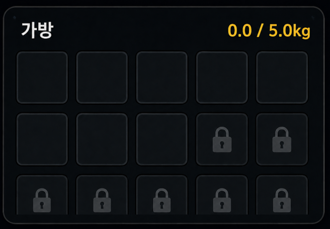
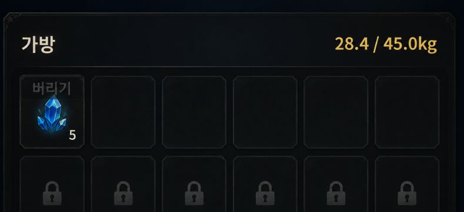
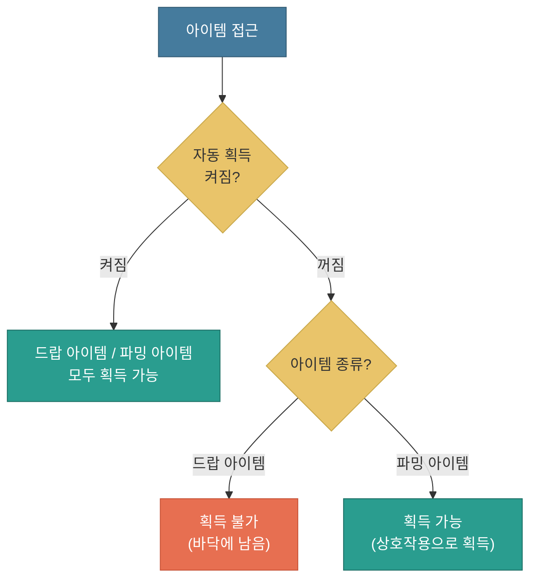
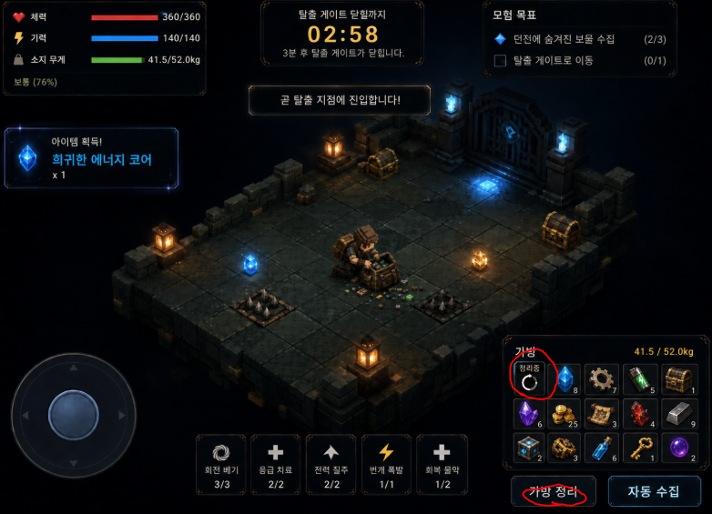
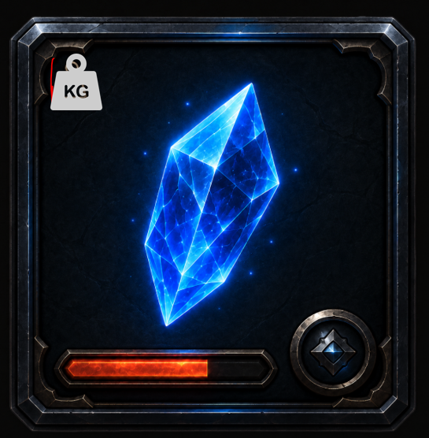

# 가방과 무게 시스템

---

## 문서 히스토리

| 버전 | 작성일 | 작성자 | 최근수정일자 | 마지막 수정자 | 상태 |
|------|--------|--------|--------------|---------------|------|
| ver01 | 2026-07-23 | 이호재 | 2026-07-23 | 이호재 | 진행중 |

**ver01 요약** — 현 프로젝트(로컬) 기준으로 가방/무게 시스템의 구성과 내용을 러프하게 정리. 가방 용량(무게/슬롯), 무게 5단계 페널티, 획득 제한, 무게 증감, 컬럼 정리.

---

**목차**

1. 개요
2. 가방
3. 무게와 이동 패널티
4. 무게가 늘고 주는 경우
5. 획득 제한
6. 가방 정리 시스템
7. 컬럼 목록 정리

---

## 1. 개요

### 1.1 개발목표

(1) 플레이어가 획득할 수 있는 아이템의 슬롯 개수를 정의합니다

* 가방에 담을 수 있는 칸 수를 정해, 얼마나 많은 종류를 챙길 수 있는지의 한도를 만듭니다

(2) 플레이어가 획득한 아이템의 무게를 관리하는 규칙을 정의합니다

* 아이템의 가치(전리품)와 속도(무게 패널티) 사이의 긴장을 만드는 핵심 요소입니다
* 많이 담을수록 느려지므로, 어디까지 담고 언제 탈출할지 판단하게 만듭니다

### 1.2 개발방향

* 드랍 아이템을 획득하면 가방에 쌓이고, 가방의 총 무게가 이동 속도에 영향을 줍니다

    -> 아이템 획득은 [드랍 아이템 시스템 문서](./드랍_아이템_시스템_v0.0.1.md)에서 다룹니다

---

## 2. 가방

### 2.1 가방 용량

* 가방은 획득한 아이템이 쌓이는 공간입니다
* **최대 무게** 한도와 슬롯 한도를 가지며, 둘 중 하나라도 꽉 차면 더 이상 담을 수 없습니다 (5장 참고)
* 슬롯 개수는 **슬롯 개수 (기본 값)**에서 시작해 **슬롯 개수 (최대 값)**까지 늘릴 수 있습니다

슬롯을 늘리는 방법은 아웃 게임(업적, 캐릭터 선택, 특성 진화 등)에서 다룰 예정이며, 별도 문서에서 정의합니다.

| 컬럼 | 값 형태 | 설명 |
|------|------|------|
| **최대 무게** | 값 | 가방이 담을 수 있는 총 무게 상한 |
| **슬롯 개수 (기본 값)** | 값 | 게임 시작 시 가지는 가방 칸의 개수 |
| **슬롯 개수 (최대 값)** | 값 | 슬롯을 늘렸을 때 도달할 수 있는 칸의 최대 개수 |

최대 무게/슬롯 개수 값은 밸런스에 맞춰 정할 예정입니다.

### 2.2 가방 표시

<!-- [이미지 삽입] 참고이미지-5번.png (가방 표시 참고 이미지) -->

* 화면 오른쪽 아래에 가방이 표시됩니다
* 같은 종류 + 같은 등급 아이템은 한 칸에 모여 개수로 표시됩니다
* 등급은 칸의 외곽선 색으로 구분합니다 (인터페이스 조정 필요)

    -> 등급/합성 규칙은 [드랍 아이템 시스템 문서](./드랍_아이템_시스템_v0.0.1.md)를 참고합니다

* 가방의 칸은 다음 두 가지로 분류됩니다

| 칸 상태 | 설명 |
|---------|------|
| 사용할 수 있는 칸 | 현재 아이템을 담을 수 있는 칸입니다 |
| 사용할 수 없는 칸 | 아직 해금되지 않아 사용할 수 없는 칸입니다 (슬롯을 늘리면 해금됩니다) |

### 2.3 아이템 버리기

<!-- [이미지 삽입] 참고이미지-6번.png (아이템 버리기 참고 이미지) -->

* 담아 둔 아이템을 버려서 무게를 줄일 수 있습니다
* 버리기는 다음 순서로 진행됩니다

(1) 아이템이 담긴 슬롯을 누르면, 해당 슬롯 위에 [버리기] 메시지가 표시됩니다

(2) [버리기]가 표시된 슬롯을 다시 누르면, 그 아이템을 제거합니다

* 한 번 제거할 때 아이템은 1개 단위로 버려집니다 (여러 개를 버리려면 그만큼 여러 번 터치해야 합니다)
* 한 슬롯에는 압축된 아이템과 압축 안 된 아이템이 함께 존재할 수 있습니다 (인터페이스에는 개수로만 보이지만, 데이터상으로는 압축 여부가 구분되어 공존합니다)
* 이 경우 **압축 안 된 아이템(오리지널 무게)을 먼저** 버립니다

    -> 압축은 플레이어가 조작으로 만든 성과이므로, 버릴 때는 성과가 없는 오리지널 무게 아이템부터 소모하여 압축 결과를 최대한 보존합니다

    -> 오리지널 무게 아이템이 더 무거우므로, 무거운 것부터 버려져 무게도 더 빠르게 줄어듭니다

    -> 압축(가방 정리)의 개념과 상세는 6장(가방 정리 시스템)에서 이어서 설명합니다

* 제거된 아이템은 땅에 떨구지 않고 그대로 삭제됩니다 (되돌릴 수 없습니다)
* 제거되는 순간 별도의 인터페이스 이펙트가 출력됩니다 (이펙트 연출 구성 필요)

---

## 3. 무게와 이동 패널티

* 가방이 무거워질수록 이동 속도가 느려집니다
* 무게 비율에 따라 단계가 나뉘고, 단계마다 이동 속도 패널티가 적용됩니다
* 각 단계는 다음 세 값으로 정의합니다

| 컬럼 | 값 범위 | 설명 |
|------|---------|------|
| **무게 비율** | 0 ~ 100 | 현재 무게가 **최대 무게** 대비 몇 %인지를 나타내는 값 |
| **단계** | 5단계 | 무게의 단계를 의미합니다 (가벼움 / 보통 / 무거움 / 매우 무거움 / 과적) |
| **이동 속도 패널티** | 0 ~ -100 | 무게에 따라 캐릭터가 느려지는 속도 비율(%)입니다 |

* 무게 비율 구간에 따른 단계와 패널티는 다음과 같습니다

| **무게 비율** | **단계** | **이동 속도 패널티** |
|----------------------|------|------------------|
| 25% 미만 | 가벼움 | 0% |
| 25% 이상 | 보통 | -7% |
| 50% 이상 | 무거움 | -13% |
| 75% 이상 | 매우 무거움 | -23% |
| 90% 이상 | 과적 | -33% |

각 구간과 패널티 수치는 현 프로젝트(로컬) 기준값이며, 밸런스에 맞춰 조정할 예정입니다.

* 무게 구간이 바뀌면 좌측 상단 무게 바의 색과 단계 이름이 바뀌어, 플레이어가 무게를 체감하도록 합니다

---

## 4. 무게가 늘고 주는 경우

### 4.1 무게가 느는 경우

* 드랍 아이템을 획득하면 그 아이템의 무게만큼 가방 무게가 늘어납니다

### 4.2 무게가 주는 경우

* 같은 등급 아이템 **합성 필요 개수 (N)**만큼 모여 상위 등급으로 자동 합성되면, 무게가 그 상위 등급 **아이템 인덱스**에 등록된 무게 값으로 전환됩니다

    -> 합성 규칙과 합성 필요 개수(N)는 [드랍 아이템 시스템 문서](./드랍_아이템_시스템_v0.0.1.md) 참고

* 합성 재료로 아이템이 소모될 때, 한 슬롯에 압축된 아이템과 압축 안 된 아이템이 공존하면 **압축 안 된 아이템(오리지널 무게)을 먼저** 소모합니다 (2.3 참고)

    -> 애써 압축한 아이템은 가방에 남겨, 압축 성과를 보존합니다

    -> 압축(가방 정리)의 개념과 상세는 6장(가방 정리 시스템)에서 이어서 설명합니다

합성의 무게 압축이 강하면 과적 압박이 약해지므로, 무게 / 패널티 / 드랍 빈도는 세트로 튜닝할 예정입니다.

---

## 5. 획득 제한

* 다음 경우 중 하나라도 해당하면 아이템을 획득할 수 없습니다

| 경우 | 설명 |
|------|------|
| 무게 초과 | 아이템을 담으면 **최대 무게**를 넘는 경우 |
| 슬롯 초과 | 가방 슬롯이 모두 차 있는 경우 |
| 자동 획득 꺼짐 | [자동 획득] 버튼이 꺼져 있는 경우 — 단, 드랍 아이템만 획득되지 않고, 파밍 아이템은 획득할 수 있습니다 |

    -> 드랍 아이템과 파밍 아이템의 구분은 [파밍 아이템 및 포인트 시스템 문서](./파밍_아이템_및_포인트_시스템_v0.0.1.md)에서 다룹니다

* 획득할 수 없는 아이템은 그대로 바닥에 남습니다 (두고 가는 선택)

* [자동 획득] 꺼짐 상태에서의 아이템 종류별 획득 여부는 다음과 같습니다

    -> 자동 획득 버튼과 아이템 종류는 [드랍 아이템 시스템 문서](./드랍_아이템_시스템_v0.0.1.md)를 참고합니다

---

## 6. 가방 정리 시스템

* 기존에 획득한 아이템의 무게를 줄일 수 있는 시스템입니다
* 아이템의 개수는 그대로 유지하되, 무게만 압축시킵니다
* 화면 오른쪽 하단에 [가방 정리] 버튼이 있으며 ([자동 획득] 버튼 옆), 이 버튼을 눌러 압축을 시작합니다
* 가방 정리는 **파밍 포인트**에서 진행합니다

    -> 파밍 포인트는 필드 사이드에 배치되어 파밍 목적과 안전지대 역할을 겸합니다. 압축 중에는 이동할 수 없으므로(6.6 참고), 위험을 피할 수 있는 안전지대에서 정리하도록 유도합니다

    -> 파밍 포인트와 안전지대의 상세는 [파밍 아이템 및 포인트 시스템 문서](./파밍_아이템_및_포인트_시스템_v0.0.1.md)와 [필드 규칙 및 절차 문서](./필드_규칙_및_절차_v0.0.1.md)에서 다룹니다

### 6.1 무게 압축

<!-- [이미지 삽입] 참고이미지-7번.png (무게 압축 참고 이미지) -->

* 각 아이템은 1개마다 고유의 정해진 **아이템 무게**를 가집니다
* 무게는 최대 2회까지 압축할 수 있습니다

* 예시 — 아이템 A의 무게가 20인 경우

| 상태 | 무게 |
|------|------|
| 기본 | 20 |
| 1회 압축 | 18 |
| 2회 압축 | 16 |

압축 단계별 무게 값(1회/2회)은 아이템마다 정의하며, 밸런스에 맞춰 조정할 예정입니다

### 6.2 압축 진행 방식

* 압축은 아이템 개수에 비례하여 실시간으로 진행됩니다
* 가방에 담긴 아이템을 **아이템 정렬 순서 (Priority)**가 높은 것부터, 맨 앞에서부터 순차적으로 압축합니다

    -> 정렬 순서는 [드랍 아이템 시스템 문서](./드랍_아이템_시스템_v0.0.1.md)에서 정의합니다

* 각 아이템은 1개씩 순서대로 압축되며, 한 슬롯의 개수를 모두 압축하면 다음 슬롯으로 넘어갑니다

    -> 예: 1번 슬롯 아이템 3개 (1/3 -> 2/3 -> 3/3) -> 2번 슬롯 아이템 1개 (1/1) -> 3번 슬롯 아이템 2개 (1/2 -> 2/2)

* 아이템마다 압축에 걸리는 **압축 시간** 값을 가집니다 (아이템 1개를 압축하는 데 걸리는 시간)

### 6.3 압축 시 연출 및 인터페이스 표시

* 압축이 진행되는 동안, 가방의 해당 슬롯에 압축 상태가 표시됩니다
* 아이템의 압축 진행도(현재 개수 / 전체 개수)와 압축 단계를 슬롯에서 확인할 수 있습니다 (슬라이드 바 형태)
* 아이템이 압축되는 순간 별도의 연출(이펙트)이 출력됩니다
* 압축이 진행되는 동안, 플레이어 캐릭터는 전용 모션(가방을 뒤적거리거나 전용 모션 출력)을 출력합니다

    -> 압축 중임을 시각적으로 드러내어, 플레이어가 현재 정리 중인 상태임을 직관적으로 인지할 수 있게 합니다

    -> 압축 중 이동 제약은 6.6에서, 이동/피해에 따른 중단은 6.5에서 다룹니다

(압축 연출 및 인터페이스 표시 방식 구성 필요 + 정운님 도와줘!!!)

### 6.4 인터페이스 세부 규칙 (슬롯)

(1) 무게추 아이콘

<!-- [이미지 삽입] 참고이미지-8번.PNG (무게추 아이콘 참고 이미지) -->

* 각 아이템의 슬롯 공간 왼쪽 상단에 [무게추] 형식의 아이콘을 추가합니다
* 한 슬롯에는 압축된 아이템과 압축 안 된 아이템이 공존하며, 인터페이스에는 개수로만 보이고 압축 여부는 개별로 드러나지 않습니다 (2.3 참고)
* 무게추 아이콘의 색상으로, 그 슬롯이 **전체적으로 어느 정도 압축되었는지**를 한눈에 표시합니다

    -> 개별 아이템의 압축 여부를 일일이 보여주는 대신, 슬롯 전체의 압축 정도를 무게추 색 하나로 요약합니다

(2) 색상 판정 기준

* 색상은 압축 단계(1회/2회)에 고정하지 않고, 슬롯 전체의 **현재 무게 합계 / 오리지널 무게 합계 비율**로 실시간 판정합니다

    -> 슬롯의 아이템 개수와 압축 조합이 계속 달라지면 전체 무게도 함께 변하므로, 특정 압축 단계에 색을 고정하지 않고 슬롯 합계 비율로 판정합니다

    -> 임계값에 여유를 두어, 무게가 출렁여도 색상이 안정적으로 결정되도록 합니다

* 색상 단계

| 색상 | 조건 (슬롯 현재 무게 합계 / 오리지널 무게 합계) | 의미 |
|------|------|------|
| **빨간색** | 기본 (압축 전 또는 임계 미달) | 압축이 거의 진행되지 않은 상태 |
| **노란색** | 오리지널 무게 합계의 85% 이하 | 어느 정도 압축된 상태 |
| **흰색** | 오리지널 무게 합계의 70% 이하 | 충분히 압축된 상태 |

* 예시 — 한 슬롯에 아이템 5개, 개당 오리지널 무게 1kg (오리지널 합계 5kg)

| 상태 | 슬롯 무게 합계 | 오리지널 합계 대비 | 무게추 색상 |
|------|------|------|------|
| 전부 압축 전 | 5.0 | 100% | **빨간색** |
| 전부 1회 압축 | 4.0 | 80% | **노란색** |
| 전부 2회 압축 | 3.0 | 60% | **흰색** |

    -> 압축본과 오리지널이 섞이면 합계는 그 중간값이 되며, 무게추 색도 해당 비율 구간을 따릅니다

(색상 임계값 85% / 70%는 예시값이며, 밸런스에 맞춰 조정할 예정입니다)

### 6.5 압축 완료 및 중단 조건

(1) 완료 조건

* 가방의 모든 아이템이 압축 가능한 최대 단계까지 압축되면, 더 이상 가방 정리가 진행되지 않습니다

    -> 더 압축할 아이템이 없으면 [가방 정리] 버튼을 눌러도 압축이 시작되지 않습니다

(2) 중단 조건

* 다음 경우 압축이 즉시 중단(해제)됩니다

| 경우 | 설명 |
|------|------|
| 이동 | 플레이어 캐릭터가 이동 조작을 하는 경우 |
| 피해 | 플레이어 캐릭터가 피해를 받는 경우 |

    -> 압축이 중단되면, 그 시점까지 진행된 압축 결과는 유지됩니다

### 6.6 압축 시 예외처리 사항

* 플레이어 캐릭터가 압축 중일 때는 이동할 수 없습니다 (이동 시 6.5의 중단 조건이 적용됩니다)
* 압축 중에는 아이템 슬롯을 터치하여 아이템을 버릴 수 없습니다 (2.3 버리기 조작이 막힙니다)
* 압축 중에는 아이템을 획득할 수 없습니다

    -> 압축 중에는 가방의 아이템 구성이 바뀌지 않도록 하여, 압축 진행 중 무게 계산이 흔들리지 않게 합니다

---

## 7. 컬럼 목록 정리

이 문서에서 다룬, 밸런스 조절을 위해 신설할 컬럼(수치 값)을 정리합니다.

### 7.1 가방 컬럼

* 가방 전체가 가지는 값입니다

| 컬럼 | 값 형태 | 설명 |
|------|---------|------|
| **최대 무게** | 값 | 가방이 담을 수 있는 총 무게 상한 |
| **슬롯 개수 (기본 값)** | 값 | 게임 시작 시 가지는 가방 칸의 개수 |
| **슬롯 개수 (최대 값)** | 값 | 슬롯을 늘렸을 때 도달할 수 있는 칸의 최대 개수 |

### 7.2 무게 구간 컬럼

* 무게 비율에 따른 패널티를 정하는 값입니다

| 컬럼 | 값 형태 | 설명 |
|------|---------|------|
| **구간 시작 비율** | 값 | 이 비율 이상이면 해당 단계 (예: 25 / 50 / 75 / 90) |
| **이동 속도 패널티** | 값 | 해당 단계에서 줄어드는 이동 속도 비율 |

### 7.3 압축 관련 컬럼

* 가방 정리(무게 압축)에 쓰이는 값입니다
* 이 값들은 아이템 하나하나가 가지는 값으로, 원본은 [드랍 아이템 시스템 문서](./드랍_아이템_시스템_v0.0.1.md)의 아이템 정의 컬럼에서 관리합니다

| 컬럼 | 값 형태 | 설명 |
|------|---------|------|
| **1회 압축 무게** | 값 | 1회 압축했을 때의 무게 값 |
| **2회 압축 무게** | 값 | 2회 압축했을 때의 무게 값 |
| **압축 시간** | 값 | 이 아이템 1개를 압축하는 데 걸리는 시간 |

* 압축 순서는 **아이템 정렬 순서 (Priority)**를 따릅니다 (6.2 참고)

---
