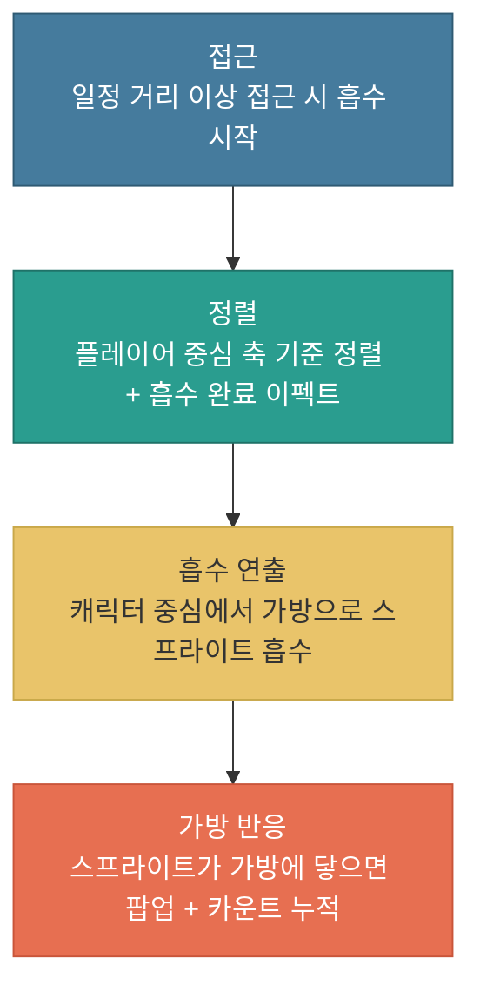

# 드랍 아이템 시스템

---

## 문서 히스토리

| 버전 | 작성일 | 작성자 | 최근수정일자 | 마지막 수정자 | 상태 |
|------|--------|--------|--------------|---------------|------|
| ver01 | 2026-07-23 |  | 2026-07-23 |  | 진행중 |

**ver01 요약** — 웹 프로토타입(NHN 2, voxel-extraction-proto) 기준으로 드랍 아이템 시스템 초안 작성 (아이템 종류, 등급, 합성, 가방/무게, 드랍 방식, 획득 연출)

---

**목차**

1. 개요
2. 아이템 종류와 등급
3. 아이템 획득 자동 합성
4. 가방과 무게
5. 존 안의 아이템 생성
6. 아이템 획득 방식
7. 아이템 획득 모드
8. 연출 구성
9. 컬럼 목록 정리

---

## 1. 개요

### 1.1 개발목표

(1) 플레이어가 이동하며 획득하는 드랍 아이템의 규칙을 정의합니다
* 파밍(전리품 획득)과 무게 압박 사이의 긴장을 만드는 핵심 요소입니다
* 직선으로만 나아가는 플레이어 캐릭터에게 단기적인 이동 목표를 제공합니다
* 해당 아이템들은 플레이어가 즉시 획득할 수 있는 아이템들로 구성되어, 이동 중 자연스럽게 파밍이 이어지도록 합니다

---

## 2. 아이템 종류와 등급

### 2.1 아이템 종류

* 아이템은 종류마다 무게가 다릅니다

* 예시

| 아이템 | 무게 |
|--------|------|
| 붉은 에테르 | XX |
| 파란 에테르 | XX |
| 노란 에테르 | XX |

* 사용하는 컬럼 정리

| 컬럼 | 설명 |
|------|------|
| **아이템 인덱스** | 각 아이템을 구분하는 고유 번호 |
| **아이템 무게** | 아이템의 무게를 추가합니다 |
| **아이템 가치 값** | 존 안에서 이 아이템이 얼마나 나올지를 정하는 값 (5장 참고). 등급과는 다른 개념. 존은 [필드 규칙 및 절차 문서](./필드_규칙_및_절차_v0.0.1.md) 참고 |
| **아이템 정렬 순서 (Priority)** | 가방에서 아이템이 정렬되는 순서를 정하는 값 ([가방과 무게 시스템 문서](./가방과_무게_시스템_v0.0.1.md) 참고) |
| **1회 압축 무게** | 가방 정리로 1회 압축했을 때의 무게 값 ([가방과 무게 시스템 문서](./가방과_무게_시스템_v0.0.1.md) 참고) |
| **2회 압축 무게** | 가방 정리로 2회 압축했을 때의 무게 값 ([가방과 무게 시스템 문서](./가방과_무게_시스템_v0.0.1.md) 참고) |
| **압축 시간** | 이 아이템 1개를 압축하는 데 걸리는 시간 ([가방과 무게 시스템 문서](./가방과_무게_시스템_v0.0.1.md) 참고) |

### 2.2 등급

* 아이템은 4개의 등급으로 나뉘며, 등급이 높을수록 가치가 큽니다

| 등급 | 색상 |
|------|------|
| 일반 | 흰색 |
| 희귀 | 파랑 |
| 영웅 | 보라 |
| 전설 | 빨강 |

* 가방에서는 등급을 외곽선 색으로 구분합니다

* 사용하는 컬럼 정리

| 컬럼 | 설명 |
|------|------|
| **아이템 등급 (Grade)** | 일반, 희귀, 영웅, 전설 |

### 2.3 획득 가능한 아이템 종류

* 획득 가능한 아이템은 다음과 같습니다

| 종류 | 설명 |
|------|------|
| 드랍 아이템 | 존을 이동하면서 획득할 수 있는 아이템입니다 ([드랍 아이템 시스템 문서](./드랍_아이템_시스템_v0.0.1.md)) |
| 파밍 아이템 | 파밍 포인트에서 상호작용하여 획득할 수 있는 아이템입니다 ([파밍 아이템 및 포인트 시스템 문서](./파밍_아이템_및_포인트_시스템_v0.0.1.md)) |

---

## 3. 아이템 획득 자동 합성

### 3.1 합성 규칙

* 같은 등급 아이템 **합성 필요 개수 (N)** 만큼 모으면 다음 등급 아이템으로 합쳐집니다

    -> N이 5인 경우: 일반 5개 -> 희귀 / 희귀 5개 -> 영웅 / 영웅 5개 -> 전설

* 합성에 필요한 개수(N)는 컬럼 값으로 조정합니다

* 합성 시 무게는 1개분으로 압축됩니다

* 사용하는 컬럼 정리

| 컬럼 | 설명 |
|------|------|
| **합성 필요 개수 (N)** | 같은 등급 아이템 몇 개가 모이면 다음 등급으로 합성되는지 정하는 값 |

### 3.2 합성 효과

| 항목 | 효과 |
|------|------|
| 무게 | 5개 무게가 1개분으로 줄어듭니다 (무게 압축) |

합성의 무게 압축이 강하면 과적 압박이 약해지므로, 무게 / 페널티 / 드랍 빈도는 세트로 튜닝할 예정입니다.

---

## 4. 가방과 무게

* 가방 및 무게 시스템의 세부 내용은 별도 문서에서 다룹니다 ([가방 및 무게 시스템 문서](./가방과_무게_시스템_v0.0.1.md))

---

## 5. 존 안의 아이템 생성

### 5.1 바닥 아이템 생성

* 아이템은 존 안에 정해진 수치 범위 안에서 무작위로 생성되며, 바닥에 놓입니다

### 5.2 바닥의 아이템 생성 방식

* 바닥의 아이템은 정해진 규칙 안에서 존 안에 랜덤으로 생성되며, 다음과 같은 규칙을 가집니다

(1) 각 아이템은 **아이템 인덱스**를 가지고 있습니다

(2) 각 아이템이 붙어서 생성되는 것을 방지하기 위해, **생성 간격 거리** 컬럼 값을 사용합니다

(3) 존 안에 아이템이 얼마나 나올지는 **아이템 가치 값**으로 조정합니다

* 가치는 등급과는 다른 개념입니다. 아이템마다 "가치 값"을 매겨 두고, 존에는 채울 수 있는 가치의 상한/하한(예산)을 정합니다
* 존은 이 예산 안에서 아이템을 채웁니다. 가치가 높은 아이템일수록 예산을 많이 차지하므로 적게 나오고, 가치가 낮은 아이템은 많이 나옵니다

    -> 예: 존 예산이 100이고, 가치 10짜리 아이템은 최대 10개, 가치 50짜리 아이템은 최대 2개 정도 나오는 식입니다

(4) 각 스테이지의 어느 존에서 아이템을 등장시킬지 정하기 위해, **아이템 등장 존** 컬럼 값을 사용합니다 (**아이템 등장 존_1**, **아이템 등장 존_2** ...)

    -> 존 관련된 내용은 [필드_규칙_및_절차](./필드_규칙_및_절차_v0.0.1.md) 문서를 참고합니다

* 사용하는 컬럼 정리

| 컬럼 | 설명 |
|------|------|
| **아이템 인덱스** | 각 아이템을 구분하는 고유 번호 |
| **생성 간격 거리** | 아이템이 서로 붙어서 생성되지 않도록 하는 최소 간격 |
| **아이템 가치 값** | 존 안의 드랍 아이템 개수를 조정하는 값 |
| **아이템 등장 존_1, _2 ...** | 아이템이 등장할 존을 지정하는 값 |

---

## 6. 아이템 획득 방식

### 6.1 플레이어 캐릭터 접근 시

* 바닥에 놓인 아이템은 플레이어 캐릭터가 일정 거리 이상 접근했을 때 흡수되는 형태로 획득합니다
* 흡수가 시작되는 거리는 플레이어 캐릭터의 **아이템 획득 거리** 옵션 값으로 정의합니다

    -> 지상이가 좋아하는 자석펫놀이

### 6.2 아이템 획득 절차

* 아이템 획득은 다음 순서로 진행됩니다

(1) 플레이어 캐릭터가 일정 거리 이상 접근하면 아이템 흡수가 시작됩니다

(2) 아이템이 플레이어 중심 축 기준으로 정렬되면 흡수 완료 이펙트가 캐릭터에게 출력됩니다
-> 플레이어 중심 축 기준 정렬은 개발이 필요합니다

(3) 이후 아이템이 스프라이트 형태로 인벤토리에 흡수되는 연출을 재생합니다 (캐릭터 중심에서 스프라이트가 시작하여 가방으로 빨려 들어가는 연출)
-> 연출 상세는 8.1 연출 구성에서 다룹니다

(4) 스프라이트가 가방에 닿으면 인터페이스가 팝업 형태로 반응하며, 아이템 카운트가 누적됩니다

> [개발 확인] — 아이템 정렬 기준(플레이어 중심 축) 처리 방식은 개발 협의가 필요합니다

### 6.3 아이템 획득 규칙

* 하나의 오브젝트는 한 개의 아이템입니다 (여러 개가 될 수 없습니다)
* 다음 두 경우 중 하나라도 해당하면, 플레이어 캐릭터가 아이템에 접근하더라도 획득할 수 없습니다 (아이템이 흡수 상태가 되지 않습니다)

    -> (1) 가방 무게가 최대치를 넘는 경우

    -> (2) 가방 슬롯이 꽉 찬 경우

    -> 무게/슬롯 한도는 [가방과 무게 시스템 문서](./가방과_무게_시스템_v0.0.1.md)에서 다룹니다

---

## 7. 아이템 획득 모드

### 7.1 아이템 획득 모드

* 화면 오른쪽 하단에 [자동 수집] 버튼을 추가합니다

| 상태 | 동작 |
|------|------|
| 활성화 | 주변의 아이템들을 흡수합니다 |
| 비활성화 | 주변의 아이템을 흡수하지 않으며, 드랍 아이템을 획득하지 않습니다 |

* 기본 값은 "활성화" 상태입니다

* 끌 수 있게 하는 이유 — 아이템 무게가 높을수록 플레이어 캐릭터는 이동 속도 패널티를 받습니다. 이 패널티를 받고 싶지 않을 때, 획득을 꺼서 무게가 늘지 않도록 하기 위함입니다

    -> 무게 패널티는 [가방과 무게 시스템 문서](./가방과_무게_시스템_v0.0.1.md)에서 다룹니다

---

## 8. 연출 구성

### 8.1 획득 연출

* 아이템을 획득하면 파티클과 함께 포물선을 그리며 가방으로 날아갑니다
* 가방에 꽂히는 순간 가방이 살짝 튀는 피드백을 줍니다

스프라이트 이펙트 및 연출 구성이 필요합니다.

---

## 9. 컬럼 목록 정리

이 문서에서 다룬 컬럼(수치 값)을 한곳에 모아 정리합니다.

### 9.1 아이템 정의 컬럼

* 아이템 하나하나가 가지는 값입니다

| 컬럼 | 설명 |
|------|------|
| **아이템 인덱스** | 각 아이템을 구분하는 고유 번호 |
| **아이템 무게** | 아이템의 무게 |
| **아이템 등급 (Grade)** | 일반, 희귀, 영웅, 전설 |
| **아이템 가치 값** | 존 안에서 이 아이템이 얼마나 나올지를 정하는 값 (5장 참고). 존은 [필드 규칙 및 절차 문서](./필드_규칙_및_절차_v0.0.1.md) 참고 |
| **아이템 정렬 순서 (Priority)** | 가방에서 아이템이 정렬되는 순서를 정하는 값 ([가방과 무게 시스템 문서](./가방과_무게_시스템_v0.0.1.md) 참고) |
| **1회 압축 무게** | 가방 정리로 1회 압축했을 때의 무게 값 ([가방과 무게 시스템 문서](./가방과_무게_시스템_v0.0.1.md) 참고) |
| **2회 압축 무게** | 가방 정리로 2회 압축했을 때의 무게 값 ([가방과 무게 시스템 문서](./가방과_무게_시스템_v0.0.1.md) 참고) |
| **압축 시간** | 이 아이템 1개를 압축하는 데 걸리는 시간 ([가방과 무게 시스템 문서](./가방과_무게_시스템_v0.0.1.md) 참고) |

### 9.2 존 생성 컬럼

* 존 안에 아이템을 어떻게 생성할지 정하는 값입니다 ([필드_규칙_및_절차](./필드_규칙_및_절차_v0.0.1.md) 문서 참고)

| 컬럼 | 설명 |
|------|------|
| **생성 간격 거리** | 아이템이 서로 붙어서 생성되지 않도록 하는 최소 간격 |
| **아이템 가치 값** | 존 안의 드랍 아이템 개수를 조정하는 값 |
| **아이템 등장 존_1, _2 ...** | 아이템이 등장할 존을 지정하는 값 |

### 9.3 플레이어 옵션 컬럼

* 플레이어 캐릭터가 가지는 값입니다

| 컬럼 | 설명 |
|------|------|
| **아이템 획득 거리** | 아이템 흡수가 시작되는 접근 거리 |

### 9.4 전역 설정 컬럼

* 특정 아이템/존에 속하지 않고, 게임 전체에 공통으로 적용되는 값입니다

| 컬럼 | 설명 |
|------|------|
| **합성 필요 개수 (N)** | 같은 등급 아이템 몇 개가 모이면 다음 등급으로 합성되는지 정하는 값 (3장 참고) |

---
