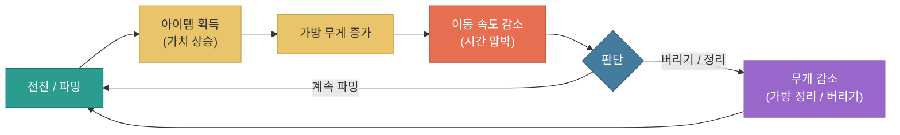

# 코어 메카닉 및 게임 플로우

---

## 문서 히스토리

| 버전 | 작성일 | 작성자 | 최근수정일자 | 마지막 수정자 | 상태 |
|------|--------|--------|--------------|---------------|------|
| ver01 | 2026-07-24 | 이호재 | 2026-07-24 | 이호재 | 진행중 |

**ver01 요약** — 지금까지 작성한 시스템 문서(필드, 드랍 아이템, 파밍 아이템/포인트, 가방/무게)를 종합하여 코어 메카닉 구성과 게임 흐름을 컴팩트하게 정리.

---

**목차**

1. 개요
2. 코어 메카닉 구성
3. 게임 흐름
4. 코어 루프
5. 관련 문서

---

## 1. 개요

* 이 문서는 개별 시스템 문서들을 종합하여, 게임의 코어 메카닉과 전체 흐름을 한눈에 정리합니다
* 각 시스템의 상세 규칙은 다루지 않으며, 세부 내용은 5장의 관련 문서를 참고합니다

* 핵심 콘셉트는 다음과 같습니다

| 항목 | 내용 |
|------|------|
| 진행 | 직선으로만 전진하는 이동 (뒤쪽 바닥이 무너져 되돌아갈 수 없음) |
| 목표 | 제한 시간(2분 30초) 안에 최대한 파밍하여 탈출 |
| 긴장 | 많이 담을수록 무거워져 느려짐 (전리품 vs 이동 속도) |
| 선택 | 전진 계속 vs 파밍 포인트에 들러 파밍/정리 (시간 소모) |

---

## 2. 코어 메카닉 구성

* 코어 메카닉은 네 개의 축으로 구성됩니다

| 축 | 내용 | 정본 문서 |
|----|------|-----------|
| 필드 / 진행 | 블록 - 존 - 필드(스테이지)의 절차 생성, 뒤쪽 바닥 붕괴로 전진 강제 | 필드 규칙 및 절차 |
| 아이템 / 파밍 | 드랍 아이템(자동 획득) + 파밍 아이템(상호작용), 4등급 자동 합성 | 드랍 아이템 / 파밍 아이템 및 포인트 |
| 가방 / 무게 | 무게에 따른 이동 속도 페널티, 가방 정리(무게 압축), 버리기 | 가방과 무게 |
| 파밍 포인트 | 필드 양옆 구역, 파밍 + 안전지대(압축) 역할 | 파밍 아이템 및 포인트 |

```mermaid
flowchart TD
    A["코어 메카닉"]:::core --> B["필드 / 진행"]:::field
    A --> C["아이템 / 파밍"]:::item
    A --> D["가방 / 무게"]:::bag
    A --> E["파밍 포인트"]:::spot
    A --> G["생존 자원"]:::hp
    A --> H["탈출 / 진행"]:::exit

    B --> B1["블록 - 존 - 필드 절차 생성"]:::sub
    B --> B2["뒤쪽 바닥 붕괴 - 전진 강제"]:::sub
    C --> C1["드랍 아이템 (자동 획득)"]:::sub
    C --> C2["파밍 아이템 (상호작용 획득)"]:::sub
    C --> C3["4등급 자동 합성"]:::sub
    D --> D1["무게 - 이동 속도 페널티"]:::sub
    D --> D2["가방 정리 (무게 압축)"]:::sub
    E --> E1["파밍 구역"]:::sub
    E --> E2["안전지대 (압축 공간)"]:::sub
    G --> G1["HP (위험으로 소모 / 회복)"]:::sub
    G --> G2["스태미나 (이동에 소모)"]:::sub
    H --> H1["지점에서 탈출"]:::sub
    H --> H2["다음 스테이지로 진행"]:::sub

    classDef core fill:#e76f51,stroke:#c9553a,color:#fff
    classDef field fill:#457b9d,stroke:#345d75,color:#fff
    classDef item fill:#2a9d8f,stroke:#1f7268,color:#fff
    classDef bag fill:#e9c46a,stroke:#c9a84a,color:#333
    classDef spot fill:#9966cc,stroke:#7a4fa3,color:#fff
    classDef hp fill:#d4380d,stroke:#a52a08,color:#fff
    classDef exit fill:#2f5a73,stroke:#1f3d4f,color:#fff
    classDef sub fill:#f4f4f4,stroke:#bbb,color:#333
```

| 생존 자원 | HP(기믹/위험으로 소모, 회복 가능)와 스태미나(이동에 소모) 관리 | <span style="color:#888888">(별도 문서 예정)</span> |
| 탈출 / 진행 | 각 지점에서 탈출할지, 다음 스테이지로 계속 갈지 선택 | <span style="color:#888888">(별도 문서 예정)</span> |



---

## 3. 게임 흐름

* 한 판(스테이지)의 진행 흐름은 다음과 같습니다

```mermaid
flowchart TD
    S["스테이지 진입<br/>(존 개수 결정, 제한 시간 2:30 시작)"]:::start --> P["전진 (직선 이동)<br/>스태미나 소모"]:::move
    P --> L["드랍 아이템 자동 획득<br/>(가방 무게 증가)"]:::loot
    L --> W{"무게 페널티?"}:::cond
    W -->|무거움| SLOW["이동 속도 감소"]:::warn
    W -->|여유| P2["계속 전진"]:::move
    P --> HZ["기믹 / 위험<br/>(HP 소모)"]:::danger
    P --> SPOT{"파밍 포인트?"}:::cond
    SPOT -->|들른다| F["상호작용 파밍 + 가방 정리(압축)<br/>안전지대 (HP 회복 / 정비)"]:::spot
    SPOT -->|지나친다| P2
    F --> P2
    SLOW --> P2
    HZ --> P2
    P2 --> BACK["뒤쪽 바닥 붕괴<br/>(되돌아갈 수 없음)"]:::danger
    BACK --> END{"스테이지 끝 지점 도달?"}:::cond
    END -->|아니오| P
    END -->|예| CHOICE{"탈출 지점 선택"}:::choice
    CHOICE -->|탈출| EXIT["탈출 / 정산<br/>(획득물 확보)"]:::end
    CHOICE -->|계속| NEXT["다음 스테이지로 진행<br/>(난이도 상승 / 더 큰 보상)"]:::start
    NEXT --> S

    classDef start fill:#457b9d,stroke:#345d75,color:#fff
    classDef move fill:#2a9d8f,stroke:#1f7268,color:#fff
    classDef loot fill:#e9c46a,stroke:#c9a84a,color:#333
    classDef cond fill:#e9c46a,stroke:#c9a84a,color:#333
    classDef choice fill:#2f5a73,stroke:#1f3d4f,color:#fff
    classDef warn fill:#e76f51,stroke:#c9553a,color:#fff
    classDef spot fill:#9966cc,stroke:#7a4fa3,color:#fff
    classDef danger fill:#e76f51,stroke:#c9553a,color:#fff
    classDef end fill:#457b9d,stroke:#345d75,color:#fff
```

* 흐름 요약

| 단계 | 내용 |
|------|------|
| 진입 | 스테이지 진입 시 존 개수가 정해지고, 제한 시간(2분 30초)이 시작됩니다 |
| 전진 | 직선으로만 이동하며, 지나가는 존의 드랍 아이템을 자동 획득합니다 (이동에 스태미나 소모) |
| 무게 관리 | 가방이 무거워지면 이동 속도 페널티를 받습니다 |
| 생존 관리 | 기믹/위험으로 HP가 소모되며, 회복이 필요합니다 |
| 파밍 포인트 | 원할 때 파밍 포인트에 들러 상호작용 파밍과 가방 정리(압축)를 진행합니다 (안전지대에서 정비) |
| 붕괴 | 지나온 뒤쪽 바닥이 무너져 되돌아갈 수 없습니다 |
| 선택 | 스테이지 끝 지점에서 탈출할지, 다음 스테이지로 계속 갈지 선택합니다 |
| 탈출 / 진행 | 탈출하면 획득물을 확보(정산)하고, 계속 가면 난이도가 오르는 대신 더 큰 보상을 노립니다 |

---

## 4. 코어 루프

* 게임의 재미는 다음 트레이드오프의 반복에서 나옵니다



* 핵심 긴장 구조

| 긴장 | 내용 |
|------|------|
| 전리품 vs 속도 | 많이 담을수록 가치는 오르지만 무거워져 느려집니다 |
| 전진 vs 파밍 | 파밍 포인트에 들르면 이득이지만 시간을 소모합니다 |
| 보존 vs 정리 | 무게를 줄이려면 압축(시간 소모)하거나 버려야(가치 손실) 합니다 |
| 생존 vs 욕심 | HP/스태미나가 버티는 한계 안에서 얼마나 더 파밍할지 판단해야 합니다 |
| 탈출 vs 진행 | 지금 탈출해 확보할지, 위험을 무릅쓰고 다음 스테이지의 더 큰 보상을 노릴지 선택합니다 |

* 플레이어는 제한 시간과 생존 자원 안에서 "어디까지 담고, 언제 정리하고, 언제 탈출할지"를 계속 판단하게 됩니다

    -> 탈출 vs 진행은 로그라이크 익스트랙션 구조의 핵심 판단으로, 잃을 위험과 얻을 보상을 저울질하게 만듭니다

---

## 5. 관련 문서

* 각 시스템의 상세 규칙은 아래 문서에서 다룹니다

| 시스템 | 문서 |
|--------|------|
| 필드 / 존 / 진행 | [필드 규칙 및 절차 문서](./필드_규칙_및_절차_v0.0.2.md) |
| 드랍 아이템 / 등급 / 합성 | [드랍 아이템 시스템 문서](./드랍_아이템_시스템_v0.0.1.md) |
| 파밍 아이템 / 파밍 포인트 | [파밍 아이템 및 포인트 시스템 문서](./파밍_아이템_및_포인트_시스템_v0.0.2.md) |
| 가방 / 무게 / 가방 정리 | [가방과 무게 시스템 문서](./가방과_무게_시스템_v0.0.1.md) |

---
