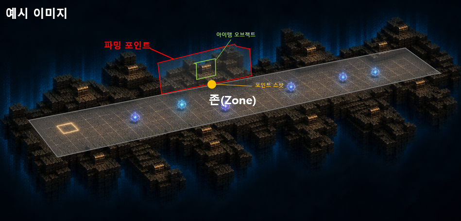
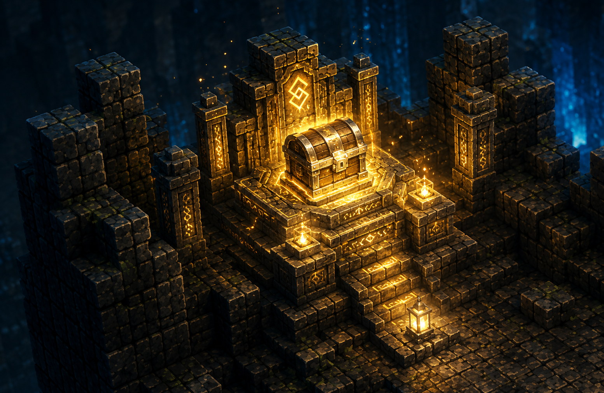
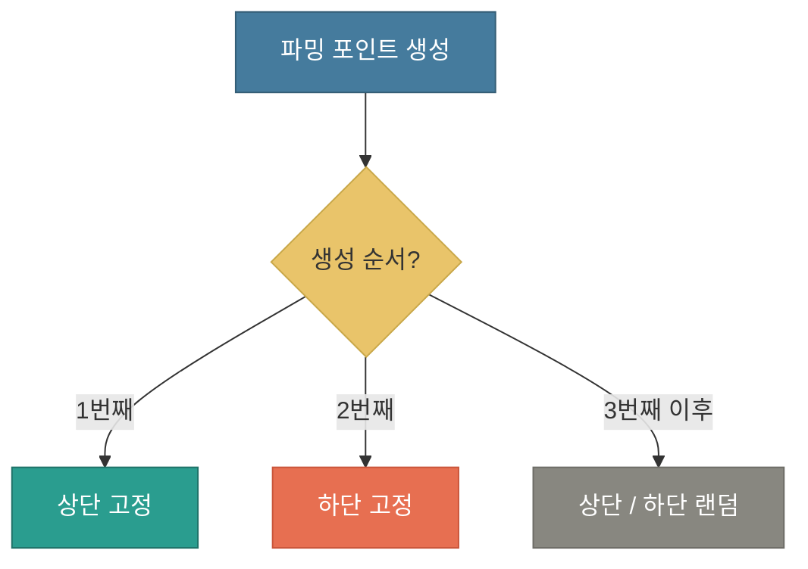
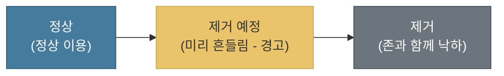
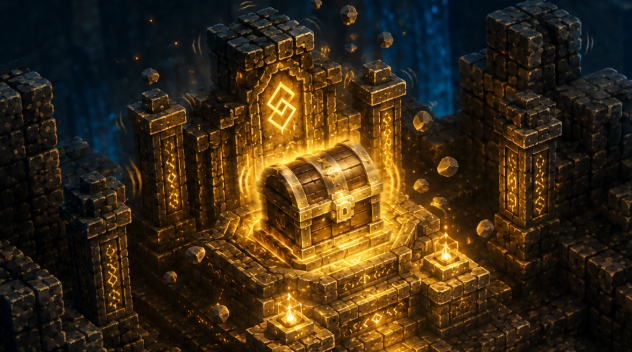
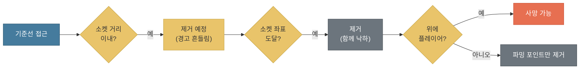
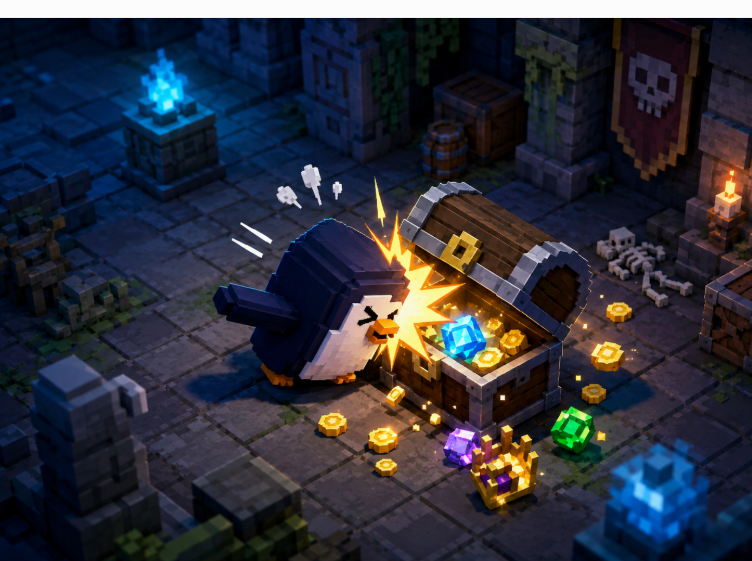
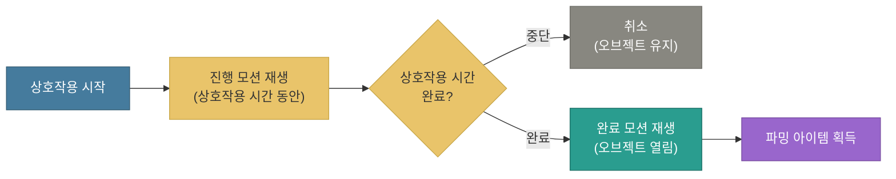
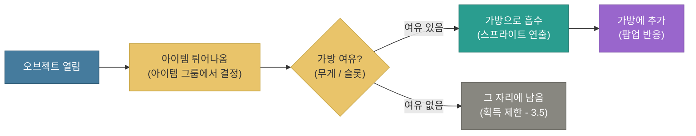

# 파밍 아이템 및 포인트 시스템

---

## 문서 히스토리

| 버전 | 작성일 | 작성자 | 최근수정일자 | 마지막 수정자 | 상태 |
|------|--------|--------|--------------|---------------|------|
| ver01 | 2026-07-23 | 이호재 | 2026-07-23 | 이호재 | 진행중 |

**ver01 요약** — 파밍 아이템과 파밍 포인트 시스템의 형식 골격 작성. (내용 작성 예정)

---

**목차**

1. 개요
2. 파밍 포인트
3. 아이템 오브젝트
4. 파밍 아이템
5. 연출 구성
6. 컬럼 목록 정리

---

## 1. 개요

### 1.1 개발목표

(1) 플레이어 캐릭터가 이동하는 필드 양옆에 파밍 포인트(구역)를 설치할 수 있게 합니다

* 필드의 좌우 사이드 공간을 활용하여, 이동 경로와 분리된 파밍 구역을 배치합니다

(2) 파밍 포인트에서 획득하는 파밍 아이템을 정의합니다

* 파밍 아이템은 드랍 아이템과는 다른 타입이며, 가치가 높은 아이템들로 구성됩니다
* 이 아이템들은 [상호작용] 행위를 통해 획득하며, 그 종류와 규칙을 본 문서에서 정의합니다

(3) 파밍 포인트를 안전지대(아이템 압축 공간)로 활용할 수 있게 합니다

* 위험이 없는 공간에서 파밍과 가방 정리(무게 압축)를 함께 진행할 수 있도록 합니다

### 1.2 개발방향

(1) 필드 사이드에 파밍 포인트(구역)를 배치합니다

* 파밍 포인트는 필드 존의 양옆에 붙는 구역으로 구성하며, 존마다 개수를 조절할 수 있게 합니다

    -> 필드 내 배치 규칙과 개수는 [필드 규칙 및 절차 문서](./필드_규칙_및_절차_v0.0.1.md)에서 다룹니다

(2) 파밍 아이템(고가치 아이템)을 본 문서에서 정의합니다

* 파밍 아이템은 드랍 아이템과 다른 타입의 고가치 아이템이며, 종류와 규칙을 본 문서에서 다룹니다
* 파밍 포인트에 설치된 아이템 오브젝트에 [상호작용]하여 획득합니다

    -> 드랍 아이템(자동 획득)과 파밍 아이템(상호작용 획득)의 타입 구분만 [드랍 아이템 시스템 문서](./드랍_아이템_시스템_v0.0.1.md)에서 함께 정리합니다

(3) 안전지대 기능을 부여합니다

* 파밍 포인트를 위험이 없는 공간으로 설정하고, 이 공간에서 가방 정리(무게 압축)를 진행할 수 있게 합니다

    -> 가방 정리(무게 압축)의 상세는 [가방과 무게 시스템 문서](./가방과_무게_시스템_v0.0.1.md) 6장에서 다룹니다

---

## 2. 파밍 포인트

### 2.1 파밍 포인트란

* 파밍 포인트는 플레이어 캐릭터가 이동하는 필드 양옆에 설치되는 구역입니다
* 이동 경로와 분리된 사이드 공간으로, 다음 세 가지 역할을 합니다

| 역할 | 설명 |
|------|------|
| 파밍 구역 | [상호작용]을 통해 파밍 아이템(고가치 아이템)을 획득하는 공간입니다 |
| 안전지대 | 기믹(장애물/위험)이 타격하거나 영향을 주지 않는 공간으로, 이 안에서 가방 정리(무게 압축)를 진행할 수 있습니다 |
| 배치 단위 | 필드 존의 양옆에 붙는 구역으로, 존마다 개수를 조절할 수 있습니다 |

* 안전지대는 기믹의 영향을 받지 않는 것을 기준으로 합니다. 다만 뒤쪽 붕괴(존 제거)는 계속 다가오므로, 붕괴가 파밍 포인트에 닿으면 함께 낙하합니다 (2.6, 2.7 참고)

* 배치 단위는 스테이지 - 존 - 파밍 포인트의 계층 구조를 따릅니다

    -> 스테이지마다 여러 개의 존이 연속되어 배치됩니다

    -> 각 존 안에서 파밍 포인트의 빈도(개수)를 결정합니다

    -> 존마다 배치할 파밍 포인트 개수는 min / max 범위로 조절하며, 상세 컬럼은 [필드 규칙 및 절차 문서](./필드_규칙_및_절차_v0.0.1.md)에서 다룹니다

    -> 파밍 아이템의 종류와 규칙은 3장에서 다룹니다

    -> 가방 정리(무게 압축)의 상세는 [가방과 무게 시스템 문서](./가방과_무게_시스템_v0.0.1.md) 6장에서 다룹니다

    -> 필드 내 파밍 포인트의 배치와 개수는 [필드 규칙 및 절차 문서](./필드_규칙_및_절차_v0.0.1.md)를 참고합니다

### 2.2 파밍 포인트 구성

<!-- [이미지 삽입] 참고이미지-9번.PNG (파밍 포인트 구성 참고 이미지) -->

* 파밍 포인트는 다음 네 가지 요소로 구성됩니다

(1) 파밍 포인트

* 파밍이 이루어지는 구역 그 자체입니다
* 크기는 4x4 이상 ~ 7x7 범위로 구성합니다
* 프리팹 형식으로 별도 지형을 직접 제작합니다

(2) 포인트 소켓

* 파밍 포인트와 존을 잇는 연결 부위이며, 파밍 포인트의 입구가 됩니다
* 파밍 포인트에서 각 포인트 소켓의 위치를 지정하여, 존에 절차적으로 생성(연결)할 수 있게 합니다
* 하나의 포인트 소켓은 존과 파밍 포인트를 1대1로 연결합니다 (한 소켓에 여러 개가 붙을 수 없습니다)
* 포인트 소켓과 같은 선상의 좌표가 파밍 포인트의 입구입니다

    -> 포인트 소켓의 좌표는 이후 파밍 포인트 제거(낙하) 판단의 기준이 됩니다 (2.7 참고)

(3) 오브젝트 스팟

* 파밍 포인트 안에서 아이템 오브젝트가 생성되는 자리입니다
* 파밍 포인트에서 각 오브젝트 스팟의 위치를 지정하여, 그 자리에 아이템 오브젝트를 생성합니다
* 하나의 오브젝트 스팟에는 아이템 오브젝트가 1대1로 생성됩니다 (한 스팟에 하나)
* 오브젝트 스팟은 하나의 파밍 포인트 안에 여러 개를 배치할 수 있습니다 (프리팹 제작 시 제작자가 필요한 만큼 배치합니다)

    -> 스팟 하나에는 아이템 오브젝트 하나가 생성되며, 스팟을 여러 개 두면 그만큼 아이템 오브젝트가 생성됩니다

(4) 아이템 오브젝트

* 플레이어 캐릭터가 일정 시간 동안 상호작용하여 열 수 있는 오브젝트입니다
* 여러 가지 형태가 존재합니다 (예: 상자, 광물, 파괴할 수 있는 박스 등)
* 오브젝트 스팟 자리에 생성되며, 데이터는 드랍 아이템과 마찬가지로 별도의 테이블 데이터로 관리합니다

    -> 상호작용 방식과 획득 절차는 4장에서 다룹니다

    -> 드랍 아이템의 데이터 테이블 구조는 [드랍 아이템 시스템 문서](./드랍_아이템_시스템_v0.0.1.md)를 참고합니다

**아이템 오브젝트의 상세한 내용은 뒤에서 이어서 다룹니다**

### 2.3 파밍 포인트 컨셉 및 표시

<!-- [이미지 삽입] 참고이미지-10번.png (파밍 포인트 컨셉 및 표시 참고 이미지) -->

(1) 강조 표시

* 파밍 포인트는 눈에 잘 띄도록 강조합니다
* 빛/이펙트로 표현하여, 플레이어가 멀리서도 파밍 구역임을 알아챌 수 있게 합니다

    -> 발광 및 이펙트 디자인이 필요합니다 (디자인 구성 필요)

* 파밍 포인트 주변 배경을 풍부하게 표현하여, 구역이 도드라져 보이게 합니다 (배경 연출 구성 필요)

(2) 등급 위상 베리에이션

* 파밍 포인트는 등급 위상에 따라 서로 다른 형태의 베리에이션(Variation)으로 제작합니다
* 색상 구분이 아니라, 등급 위상별로 형태(프리팹)가 다른 베리입니다
* 아트 제작 시 어떤 등급 위상으로 만들지의 기준이 됩니다
* 다음 3개 등급 위상으로 프리팹을 제작합니다

| 등급 위상 |
|-----------|
| 일반 |
| 희귀 |
| 영웅 |

* 등급 위상 베리에이션은 아트 표현을 위한 구분이며, 파밍 포인트 위상과 그 안의 아이템 오브젝트 위상이 1대1로 일치하지는 않습니다
* 아이템 오브젝트는 파밍 포인트의 위상에 대체로 맞춰 배치하되, 전설 위상 아이템 오브젝트는 별도의 전설 위상 파밍 포인트를 만들지 않고 영웅 위상 파밍 포인트에 함께 배치합니다

    -> 아이템 등급 체계(일반/희귀/영웅/전설)는 [드랍 아이템 시스템 문서](./드랍_아이템_시스템_v0.0.1.md)를 참고합니다

    -> 파밍 포인트 베리에이션은 3개 위상(일반/희귀/영웅)으로만 제작하며, 전설은 영웅 위상에 포함됩니다

### 2.4 파밍 포인트 타입

* 파밍 포인트는 존에 붙는 위치에 따라 두 가지 타입으로 나뉩니다
* 두 타입은 기능은 동일하며, 배치 위치와 프리팹 구성만 다릅니다

| 타입 | 설명 |
|------|------|
| 파밍 포인트 (상단) | 존의 위쪽에 붙는 타입입니다 |
| 파밍 포인트 (하단) | 존의 아래쪽에 붙는 타입입니다 |

* 타입마다 서로 다른 프리팹으로 구성하여 배치합니다

(1) 타입을 나누는 이유

* 게임 화면을 쿼터뷰(오쏘그래픽)로 보기 때문에, 붙는 위치에 따라 단차 표현을 다르게 해야 화면에서 올바르게 보입니다

| 타입 | 단차 구성 |
|------|-----------|
| 파밍 포인트 (상단) | 단차를 높게 구성합니다 |
| 파밍 포인트 (하단) | 단차를 아래로 향하게, 낮게 구성합니다 |

    -> 상단은 화면 위쪽에 위치하므로 단차를 높여야 자연스럽게 보이고, 하단은 화면 아래쪽에 위치하므로 단차를 낮춰야 올바르게 보입니다

    -> 해당 부분은 파밍 포인트 프리팹 구성에 대한 R&D가 필요합니다

(2) 복수 배치 시 생성 규칙

* 파밍 포인트는 프리팹 형식으로 저장하지만, 실제 배치는 존 단위로 절차적으로 생성됩니다
* 한 존에 배치되는 파밍 포인트 개수는 min / max 범위로 정하므로, 2개 이상이 생성될 수 있습니다
* 파밍 포인트가 2개 이상 생성될 경우를 대비하여, 다음 규칙을 정합니다

| 항목 | 규칙 |
|------|------|
| 파밍 포인트 간 간격 | 파밍 포인트끼리 겹치거나 지나치게 몰리지 않도록 최소 간격을 정합니다 |
| 상단/하단 배분 | 상단과 하단 중 어느 타입으로 생성할지 정하는 규칙입니다 (2.5 참고) |

* 파밍 포인트는 포인트 소켓 자리에만 생성됩니다. 소켓 자리를 처음부터 이동 경로와 겹치지 않게 잡아두면, 파밍 포인트가 길을 막을 일이 없습니다

    -> 존 단위 절차 생성과 배치 수치(min / max)의 정본은 [필드 규칙 및 절차 문서](./필드_규칙_및_절차_v0.0.1.md)에서 다룹니다

(파밍 포인트 간 최소 간격, 상단/하단 배분 등 구체 수치는 밸런스에 맞춰 정할 예정입니다)

### 2.5 상단/하단 배분 규칙

* 한 존에 파밍 포인트가 여러 개 생성될 때, 생성 순서에 따라 상단/하단 타입을 정합니다
* 기본적으로 상단에 먼저 생성하며, 순서에 따라 다음과 같이 배분합니다

| 생성 순서 | 타입 |
|-----------|------|
| 1번째 | 상단 (고정) |
| 2번째 | 하단 (고정) |
| 3번째 이후 | 상단 또는 하단 (랜덤) |

* 앞의 두 개는 상단, 하단을 하나씩 고정하여 화면 위아래에 최소 하나씩은 배치되도록 합니다
* 세 번째부터는 상단과 하단 중 랜덤하게 생성하여 배치에 다양성을 줍니다
* 세 번째 이후의 랜덤은 상단 50 : 하단 50 확률을 베이스 규칙으로 합니다 (별도 컬럼 없이 고정 규칙)

### 2.6 진입 및 이용 방식

(1) 이동과 단차

* 플레이어 캐릭터는 이동만 가능한 형식입니다 (별도의 점프 등 조작 없음)
* 높은 지형이든 낮은 지형이든 이동 조작만으로 올라갈 수 있도록 단차를 조정합니다

    -> 이동 조작으로 자연스럽게 오르내릴 수 있게 단차 높이를 맞춥니다

(2) 입구 진입

* 입구 지역에서는 올라가는 지역이 보이도록 합니다
* 진입할 때 입구를 제외한 나머지 구간은 막아도 됩니다

    -> 플레이어가 어디로 진입해야 할지 입구에서 시각적으로 유도합니다

(3) 낙사 방지

* 파밍 포인트 안에서는 낙사하지 않습니다
* 끝 지점에서 바깥으로 이동 조작을 하더라도 아래로 떨어지지 않습니다

    -> 파밍 포인트는 안전지대이므로, 이동 중 실족으로 사망하지 않도록 합니다 (2.1 참고)

* 단, 존이 사라지는 연출(지형이 사라지는 연출) 시 파밍 포인트도 함께 낙하하는 경우에는 플레이어 캐릭터가 사망할 수 있습니다

    -> 존 제거(뒤쪽 바닥 제거)에 파밍 포인트가 포함되어 낙하하는 경우이며, 자세한 규칙은 2.7에서 다룹니다

    -> 존 제거(뒤쪽 바닥 제거) 시스템은 [필드 규칙 및 절차 문서](./필드_규칙_및_절차_v0.0.1.md)를 참고합니다

(4) 머무는 동안의 시간 흐름

* 파밍 포인트에 머무는 동안에도 뒤쪽 붕괴(존 제거)는 멈추지 않고 계속 다가옵니다
* 파밍 포인트에서 파밍과 가방 정리를 하는 사이에도 붕괴는 진행되므로, 무한정 머물 수 없습니다

    -> 기믹으로부터는 안전하지만 붕괴는 계속 다가오므로, 언제까지 파밍하고 언제 빠져나갈지 판단하게 됩니다

    -> 붕괴가 파밍 포인트에 닿으면 파밍 포인트도 함께 제거됩니다 (2.7 참고)

### 2.7 파밍 포인트 제거 규칙

* 파밍 포인트는 자신이 속한 존이 제거될 때 함께 제거됩니다
* 존 제거는 뒤쪽 바닥이 사라지는 방식으로 진행되며, 파밍 포인트도 존의 일부이므로 같은 흐름을 따릅니다

(1) 제거 판단 기준

* 파밍 포인트의 제거(낙하) 여부는 포인트 소켓의 좌표를 기준으로 판단합니다
* 포인트 소켓의 좌표(= 입구)가 존 제거 대상 범위에 들어가면, 해당 파밍 포인트 전체가 제거(낙하)됩니다

    -> 파밍 포인트가 존 옆으로 넓게 튀어나와 있어도, 판단은 존과 맞닿은 접점인 포인트 소켓 좌표로 통일합니다

(2) 제거 흐름

| 상태 | 파밍 포인트 처리 |
|------|------------------|
| 정상 | 정상적으로 이용할 수 있습니다 |
| 제거 예정 | 파밍 포인트도 함께 흔들립니다 (제거가 임박했음을 미리 알립니다) |
| 제거 | 파밍 포인트가 존과 함께 아래로 낙하합니다 |

(3) 제거 예정 판정

<!-- [이미지 삽입] 참고이미지-11번.PNG (흔들리는 예시 참고 이미지) -->

흔들리는 예시입니다

* 존 제거는 플레이어 캐릭터 위치에서 정해진 거리만큼 뒤쪽 바닥부터 진행됩니다
* 존 제거가 뒤에서 다가오면, 실제로 제거되기 전에 파밍 포인트를 미리 흔들어 위험이 임박했음을 경고합니다
* 존 제거 기준선과 포인트 소켓 좌표 사이의 거리가 일정 칸 이내로 가까워지면, 파밍 포인트를 "제거 예정"(흔들림) 상태로 전환합니다
* 흔들림을 시작하는 거리는 컬럼 값으로 정합니다

| 컬럼 | 값 형태 | 설명 |
|------|---------|------|
| **흔들림 시작 거리** | 값 | 존 제거 기준선과 포인트 소켓 좌표의 거리가 이 칸 수 이내이면 흔들림(제거 예정)을 시작합니다 |

    -> 존 제거 기준(플레이어 뒤 몇 칸부터 제거)과 흔들림 시간은 필드 규칙 및 절차 문서에서 다룹니다

(흔들림 시작 거리 값은 밸런스에 맞춰 정할 예정입니다)

* 제거 시점에 플레이어 캐릭터가 파밍 포인트 위에 있으면, 파밍 포인트와 함께 낙하하여 사망할 수 있습니다 (2.6 참고)

    -> 존 제거(뒤쪽 바닥 제거)의 상태 전환과 흔들림 시간 등 상세 규칙은 [필드 규칙 및 절차 문서](./필드_규칙_및_절차_v0.0.1.md)를 참고합니다

(제거 예정 상태에서 플레이어에게 위험을 알리는 표시 방식은 구성 필요)

---

## 3. 아이템 오브젝트

### 3.1 아이템 오브젝트란

* 아이템 오브젝트는 파밍 포인트 내 오브젝트 스팟에 랜덤하게 생성되는, 상호작용할 수 있는 구조물입니다
* 플레이어 캐릭터가 일정 시간 동안 상호작용하여 열면, 안에서 파밍 아이템을 획득합니다

    -> 아이템 오브젝트는 오브젝트 스팟 자리에 1대1로 생성됩니다 (2.2 참고)

    -> 어떤 오브젝트가 생성될지는 랜덤하게 정해집니다 (랜덤 규칙 상세는 3.2에서 다룸)

    -> 상호작용으로 나오는 파밍 아이템은 4장에서 다룹니다

### 3.2 오브젝트 종류

* 아이템 오브젝트는 종류와 등급으로 구분됩니다
* 프로토타입 버전 기준으로 다음 종류를 제작합니다

| 종류 | 등급 |
|------|------|
| 상자 | 일반 / 희귀 / 영웅 |
| 도자기 항아리 | 일반 / 희귀 / 영웅 |

(프로토타입 기준이며, 종류는 이후 추가될 수 있습니다)

* 오브젝트의 종류와 등급에 따라 얻을 수 있는 파밍 아이템이 달라집니다
* 이를 위해 각 아이템 오브젝트마다 별도의 파밍 아이템 테이블(아이템 그룹)이 필요합니다

    -> 예: 영웅 등급 상자와 일반 등급 도자기 항아리는 서로 다른 파밍 아이템 그룹을 참조합니다

    -> 오브젝트가 참조하는 파밍 아이템의 종류와 규칙은 4장에서 다룹니다

#### 오브젝트 생성 규칙

* 오브젝트 스팟에 어떤 아이템 오브젝트가 생성될지는, 그 파밍 포인트의 등급에 따라 확률로 정합니다
* 파밍 포인트 등급과 아이템 오브젝트 등급은 고정으로 묶여 있지 않으며, 데이터 세팅에 따라 커스텀하게 달라집니다

    -> 예: 영웅 파밍 포인트에서 영웅 오브젝트가 나올 확률을 높게, 일반 오브젝트가 나올 확률을 낮게 세팅하는 식입니다

* 파밍 포인트 등급별로 어떤 오브젝트가 나올지의 확률은 컬럼으로 정합니다 (파밍 포인트 컬럼에 추가)

| 컬럼 | 값 형태 | 설명 |
|------|---------|------|
| **오브젝트 생성 확률** | 값 | 파밍 포인트 등급별로, 각 아이템 오브젝트가 생성될 확률. 오브젝트 인덱스별로 확률을 지정합니다 |

    -> 파밍 포인트 등급 위상은 2.3을 참고합니다

(확률 값은 밸런스에 맞춰 정할 예정입니다)

* 사용하는 컬럼 정리

(1) 오브젝트 컬럼

| 컬럼 | 값 형태 | 설명 |
|------|---------|------|
| **오브젝트 인덱스** | 값 | 각 아이템 오브젝트를 구분하는 고유 번호 |
| **오브젝트 등급** | 값 | 오브젝트의 등급 (일반 / 희귀 / 영웅) |
| **아이템 그룹 인덱스** | 값 | 이 오브젝트가 참조하는 파밍 아이템 그룹의 번호. 이 그룹 안의 아이템 중에서 획득 아이템이 정해집니다 |

(2) 아이템 그룹 컬럼

* 아이템 그룹 인덱스가 가리키는 그룹 안에, 어떤 파밍 아이템이 들어갈지를 정의하는 값입니다

| 컬럼 | 값 형태 | 설명 |
|------|---------|------|
| **아이템 그룹 인덱스** | 값 | 그룹을 구분하는 번호 (오브젝트의 아이템 그룹 인덱스와 연결되는 값) |
| **파밍 아이템 인덱스** | 값 | 이 그룹에 포함되는 파밍 아이템의 번호. 그룹에 여러 아이템을 넣기 위해 여러 행으로 등록합니다 |
| **아이템 등장 확률** | 값 | 그룹 안에서 이 아이템이 뽑힐 확률. 그룹 내 아이템들의 확률을 합산하여 그중 하나가 랜덤하게 결정됩니다 |

    -> 포함되는 파밍 아이템의 종류와 규칙은 4장에서 다룹니다

#### 아이템 추첨 규칙

* 오브젝트를 열면, 참조하는 아이템 그룹에서 파밍 아이템 하나가 결정됩니다
* 그룹 안 아이템들의 **아이템 등장 확률**을 합산하고, 그 합산 확률 안에서 랜덤하게 하나를 뽑습니다
* 한 번의 획득으로 나오는 아이템은 고정으로 1개입니다

    -> 각 아이템의 등장 확률은 아이템 그룹 컬럼의 **아이템 등장 확률** 값을 사용합니다

    -> 예: 그룹에 A(확률 60), B(확률 30), C(확률 10)이 있으면, 합산 100 안에서 하나가 랜덤하게 뽑히며 결과는 항상 1개입니다

### 3.3 상호작용 방식

<!-- [이미지 삽입] 참고이미지-12번.PNG (상호작용 방식 참고 이미지) -->

* 플레이어 캐릭터가 아이템 오브젝트에 일정 시간 동안 상호작용하면, 오브젝트가 열리며 파밍 아이템을 획득합니다
* 상호작용은 오브젝트의 종류와 등급에 따라 다음과 같이 달라집니다

(1) 오브젝트 종류에 따른 상호작용 모션

* 각 아이템 오브젝트 종류마다 캐릭터의 상호작용 모션이 다릅니다

    -> 예: 상자를 여는 모션과 도자기 항아리를 여는 모션이 서로 다릅니다

* 상호작용은 두 단계의 모션으로 구성됩니다

| 단계 | 모션 | 설명 |
|------|------|------|
| 진행 중 | 상호작용 진행 모션 | 상호작용하는 동안 재생하는 모션입니다. 상호작용 시간 동안 지속됩니다 |
| 완료 | 상호작용 완료 모션 | 상호작용이 끝나 오브젝트가 열릴 때 재생하는 모션입니다 |

    -> 진행 중 모션은 상호작용 시간(3.3 (2)) 동안 재생되며, 시간이 다 차면 완료 모션으로 넘어갑니다

* 상호작용 흐름은 다음과 같습니다

(2) 오브젝트 등급에 따른 상호작용 시간

* 각 오브젝트의 등급에 따라 캐릭터의 상호작용 시간이 다릅니다

    -> 등급이 높을수록 상호작용에 걸리는 시간이 달라지며, 구체적인 값은 컬럼으로 정합니다

    -> 이 시간이 진행 중 모션이 재생되는 길이가 됩니다

* 사용하는 컬럼 정리 (아이템 오브젝트 컬럼에 추가)

* 아래 컬럼은 3.2의 오브젝트 컬럼에 이어서 추가되는 값입니다

| 컬럼 | 값 형태 | 설명 |
|------|---------|------|
| **상호작용 진행 모션** | 값 | 상호작용하는 동안 재생할 캐릭터 모션 (오브젝트 종류별) |
| **상호작용 완료 모션** | 값 | 상호작용이 끝나 오브젝트가 열릴 때 재생할 캐릭터 모션 (오브젝트 종류별) |
| **상호작용 시간** | 값 | 오브젝트 등급별로 상호작용을 완료하는 데 걸리는 시간 (진행 중 모션이 재생되는 길이) |

(상호작용 시간 값은 밸런스에 맞춰 정할 예정입니다)

(3) 상호작용 시작 조건

* 상호작용 버튼을 한 번 누르면 상호작용을 시작합니다

(4) 상호작용 중단 조건

* 다음 경우 상호작용이 즉시 중단됩니다

| 경우 | 설명 |
|------|------|
| 낙하 | 파밍 포인트가 낙하하여 캐릭터가 낙하 상태가 되는 경우 (2.7 참고) |
| 이동 | 플레이어가 이동 조작을 하는 경우 |

    -> 중단되면 오브젝트는 열리지 않고 그대로 유지되며, 다시 상호작용할 수 있습니다

(5) 상호작용 중 동작

* 상호작용을 하는 동안에도 아이템을 버릴 수 있습니다

    -> 아이템 버리기는 [가방과 무게 시스템 문서](./가방과_무게_시스템_v0.0.1.md)를 참고합니다

### 3.4 획득 절차

* 상호작용이 완료되어 오브젝트가 열린 뒤, 파밍 아이템 획득은 다음 순서로 진행됩니다

(1) 상호작용이 완료되면 오브젝트가 열립니다 (3.3에서 이어짐)

(2) 오브젝트에서 파밍 아이템이 튀어나옵니다

    -> 어떤 파밍 아이템이 나올지는 오브젝트가 참조하는 아이템 그룹에서 정해집니다 (3.2 참고)

(3) 튀어나온 아이템이 스프라이트 형태로 가방에 흡수되는 연출을 재생합니다

    -> 아이템이 튀어나온 위치에서 시작하여 가방으로 빨려 들어가는 연출입니다

(4) 스프라이트가 가방에 닿으면 인터페이스가 팝업 형태로 반응하며, 아이템이 가방에 추가됩니다

    -> 획득한 아이템의 무게/가방 처리는 [가방과 무게 시스템 문서](./가방과_무게_시스템_v0.0.1.md)를 참고합니다

    -> 흡수 연출의 상세는 5장(연출 구성)에서 다룹니다

### 3.5 획득 제한

(1) 제한 조건

* 다음 경우 중 하나라도 해당하면 파밍 아이템을 획득할 수 없습니다

| 경우 | 설명 |
|------|------|
| 무게 초과 | 아이템을 담으면 가방의 최대 무게를 넘는 경우 |
| 슬롯 초과 | 가방 슬롯이 모두 차 있는 경우 |

    -> 무게/슬롯 한도는 [가방과 무게 시스템 문서](./가방과_무게_시스템_v0.0.1.md)를 참고합니다

(2) 제한에 걸렸을 때의 처리

* 제한에 걸려도 상호작용은 정상적으로 할 수 있으며, 아이템이 튀어나오는 연출도 동일하게 재생됩니다
* 다만 아이템이 가방으로 흡수되지 않고, 그 자리에 남습니다

    -> 상호작용 도중에 가방이 가득 차는 경우는 없지만, 이미 가방이 가득 찬 상태에서는 아이템을 획득할 수 없습니다

    -> 획득하지 못한 아이템은 그 자리에 남아, 이후 가방에 여유가 생기면 다시 획득할 수 있습니다

---

## 4. 파밍 아이템

### 4.1 파밍 아이템이란

* 파밍 아이템은 각 아이템 오브젝트를 상호작용하여 열었을 때 나오는 아이템들입니다
* 드랍 아이템과는 다른 타입이며, 가치가 높은 아이템으로 구성됩니다

    -> 아이템 오브젝트 상호작용과 획득 절차는 3장에서 다룹니다

    -> 드랍 아이템(자동 획득)과 파밍 아이템(상호작용 획득)의 타입 구분은 [드랍 아이템 시스템 문서](./드랍_아이템_시스템_v0.0.1.md)를 참고합니다

* 파밍 아이템은 다음과 같은 용도로 활용됩니다

| 용도 | 설명 |
|------|------|
| 특성 개발 | 아이템을 합성하여 캐릭터의 능력치(스태미나, 체력) 특성을 개발할 수 있습니다 |
| 슬롯 증가 | 아이템으로 가방의 슬롯을 늘릴 수 있습니다 |
| 아웃 게임 활용 | 아웃 게임 콘텐츠에 활용할 수 있는 형태로 사용됩니다 |

    -> 특성 개발, 슬롯 증가 등 아웃 게임 콘텐츠는 프로토타입 버전 이후, 콘텐츠 개발 시 추가로 개발될 예정입니다

### 4.2 아이템의 종류와 등급

* 파밍 아이템은 드랍 아이템과 동일한 등급 체계를 사용합니다

| 등급 | 색상 |
|------|------|
| 일반 | 흰색 |
| 희귀 | 파랑 |
| 영웅 | 보라 |
| 전설 | 빨강 |

    -> 등급 체계와 색상 기준은 [드랍 아이템 시스템 문서](./드랍_아이템_시스템_v0.0.1.md)를 참고합니다

* 파밍 아이템은 같은 등급이 **합성 필요 개수 (N)**만큼 모이면 다음 등급 아이템 하나로 합쳐집니다
* 드랍 아이템과 달리, 파밍 아이템의 합성 필요 개수는 3개를 사용할 예정입니다

    -> N이 3인 경우: 일반 3개 -> 희귀 / 희귀 3개 -> 영웅 / 영웅 3개 -> 전설

    -> 드랍 아이템의 합성 규칙(N)은 [드랍 아이템 시스템 문서](./드랍_아이템_시스템_v0.0.1.md)를 참고합니다

(합성 필요 개수 3개는 예정 값이며, 밸런스에 맞춰 조정할 수 있습니다)

(파밍 아이템의 종류와 세부 규칙은 이후 항목에서 다룸)

### 4.3 획득 시 처리

* 획득한 파밍 아이템의 처리는 드랍 아이템과 동일한 규칙을 따릅니다

| 항목 | 처리 |
|------|------|
| 무게 증가 | 획득하면 해당 아이템의 무게만큼 가방 무게가 늘어납니다 |
| 가방 적재 | 같은 종류 + 같은 등급 아이템은 한 칸에 모여 개수로 표시됩니다 |
| 자동 합성 | 같은 등급이 합성 필요 개수(N)만큼 모이면 다음 등급으로 자동 합성됩니다 (4.2 참고) |
| 무게 압축 | 가방 정리(무게 압축) 대상이 됩니다 |

    -> 무게, 가방 적재, 무게 압축 등 세부 처리는 [가방과 무게 시스템 문서](./가방과_무게_시스템_v0.0.1.md)를 참고합니다

    -> 드랍 아이템의 획득 시 처리 규칙은 [드랍 아이템 시스템 문서](./드랍_아이템_시스템_v0.0.1.md)를 참고합니다

### 4.4 컬럼 구성

* 파밍 아이템은 우선 드랍 아이템과 동일한 컬럼 구조를 사용합니다

(1) 파밍 아이템 컬럼

| 컬럼 | 값 형태 | 설명 |
|------|---------|------|
| **아이템 인덱스** | 값 | 각 파밍 아이템을 구분하는 고유 번호 |
| **아이템 무게** | 값 | 아이템의 무게 |
| **아이템 가치 값** | 값 | 아이템의 가치 |
| **아이템 등급 (Grade)** | 값 | 일반 / 희귀 / 영웅 / 전설 |
| **아이템 정렬 순서 (Priority)** | 값 | 가방에서 정렬되는 순서. 파밍 아이템과 드랍 아이템의 정렬 순서가 같을 경우, 파밍 아이템이 우선적으로 노출됩니다 |
| **합성 필요 개수 (N)** | 값 | 다음 등급으로 합성되는 데 필요한 개수 (파밍 아이템은 3 예정) |
| **1회 압축 무게** | 값 | 1회 압축했을 때의 무게 |
| **2회 압축 무게** | 값 | 2회 압축했을 때의 무게 |
| **압축 시간** | 값 | 이 아이템 1개를 압축하는 데 걸리는 시간 |

* 드랍 아이템의 컬럼 구조는 드랍 아이템 시스템 문서를 참고합니다
* 각 파밍 아이템이 어떤 아이템 그룹에 들어갈지는 파밍 아이템 컬럼이 아니라, 아이템 그룹 컬럼에서 파밍 아이템 인덱스를 입력하는 방식으로 관리합니다 (3.2 참고)

---

## 5. 연출 구성

### 5.1 획득 연출

(작성 예정)

### 5.2 상호작용 연출

(작성 예정)

---

## 6. 컬럼 목록 정리

이 문서에서 다룬, 밸런스 조절을 위해 신설할 컬럼(수치 값)을 정리합니다.

### 6.1 파밍 포인트 컬럼

* 파밍 포인트의 배치, 제거, 오브젝트 생성에 쓰이는 값입니다

| 컬럼 | 값 형태 | 설명 | 참고 |
|------|---------|------|------|
| **파밍 포인트 간 간격** | 값 | 한 존에 파밍 포인트가 여러 개일 때, 서로 겹치거나 몰리지 않도록 하는 최소 간격 | 2.4 |
| **흔들림 시작 거리** | 값 | 존 제거 기준선과 포인트 소켓 좌표의 거리가 이 칸 수 이내이면 흔들림(제거 예정)을 시작합니다 | 2.7 |
| **오브젝트 생성 확률** | 값 | 파밍 포인트 등급별로, 각 아이템 오브젝트가 생성될 확률 (오브젝트 인덱스별 지정) | 3.2 |

* 다음 값은 이 문서에서 사용하지만, 원본은 다른 문서에서 관리합니다

| 컬럼 | 값 형태 | 설명 | 원본 문서 |
|------|---------|------|-----------|
| 파밍 포인트 개수 | min / max | 한 존에 배치할 파밍 포인트의 개수 범위 | [필드 규칙 및 절차 문서](./필드_규칙_및_절차_v0.0.1.md) |
| 존 제거 시작 거리 | 값 | 플레이어 캐릭터 뒤 몇 칸부터 존(바닥)을 제거할지 정하는 값 | [필드 규칙 및 절차 문서](./필드_규칙_및_절차_v0.0.1.md) |
| 흔들림 시간 | 값 | 제거 예정 상태에서 바닥/파밍 포인트가 흔들리는 시간 | [필드 규칙 및 절차 문서](./필드_규칙_및_절차_v0.0.1.md) |

* 다음은 컬럼이 아니라 문서에 정한 고정 규칙(베이스 규칙)입니다

| 항목 | 값 | 참고 |
|------|-----|------|
| 파밍 포인트 크기 | 4x4 이상 ~ 7x7 | 2.2 |
| 상단/하단 배분 (3번째 이후 랜덤) | 상단 50 : 하단 50 | 2.5 |

### 6.2 아이템 오브젝트 컬럼

* 아이템 오브젝트 하나가 가지는 값입니다

| 컬럼 | 값 형태 | 설명 | 참고 |
|------|---------|------|------|
| **오브젝트 인덱스** | 값 | 각 아이템 오브젝트를 구분하는 고유 번호 | 3.2 |
| **오브젝트 등급** | 값 | 오브젝트의 등급 (일반 / 희귀 / 영웅) | 3.2 |
| **아이템 그룹 인덱스** | 값 | 이 오브젝트가 참조하는 파밍 아이템 그룹의 번호 | 3.2 |
| **상호작용 진행 모션** | 값 | 상호작용하는 동안 재생할 캐릭터 모션 (오브젝트 종류별) | 3.3 |
| **상호작용 완료 모션** | 값 | 상호작용이 끝나 오브젝트가 열릴 때 재생할 캐릭터 모션 (오브젝트 종류별) | 3.3 |
| **상호작용 시간** | 값 | 오브젝트 등급별로 상호작용을 완료하는 데 걸리는 시간 | 3.3 |

### 6.3 아이템 그룹 컬럼

* 오브젝트가 참조하는 아이템 그룹의 값이며, 그룹 안 아이템을 여러 행으로 등록합니다

| 컬럼 | 값 형태 | 설명 | 참고 |
|------|---------|------|------|
| **아이템 그룹 인덱스** | 값 | 그룹을 구분하는 번호 (오브젝트의 아이템 그룹 인덱스와 연결) | 3.2 |
| **파밍 아이템 인덱스** | 값 | 이 그룹에 포함되는 파밍 아이템의 번호 | 3.2 |
| **아이템 등장 확률** | 값 | 그룹 안에서 이 아이템이 뽑힐 확률 (합산 확률로 하나가 결정됨) | 3.2 |

### 6.4 파밍 아이템 컬럼

(작성 예정 — 4장 파밍 아이템 작성 시 정리)

---
