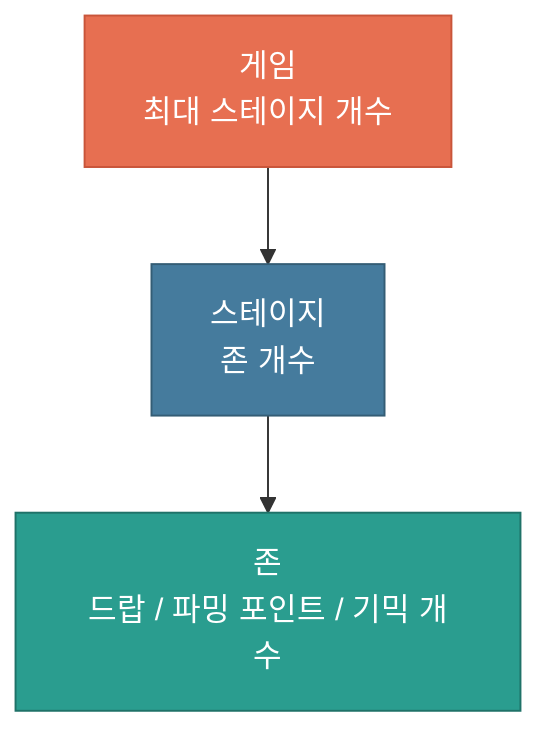

# 필드 규칙 및 절차

---

## 문서 히스토리

| 버전 | 작성일 | 작성자 | 최근수정일자 | 마지막 수정자 | 상태 |
|------|--------|--------|--------------|---------------|------|
| ver01 | 2026-07-22 |  | 2026-07-22 |  | 진행중 |

---

**목차**

1. 개요
2. 필드 구성 및 정의
3. 존 진행 및 절차 생성
4. 컬럼 정리

---

## 1. 개요

### 1.1 개발목표

(1) 플레이어 캐릭터가 걸어다닐 수 있는 필드의 기준과 목표를 정의합니다
* 규격화된 필드의 기준으로, 파밍존의 빈도, 장애물, 오브젝트, 기믹의 규칙을 수립하는 기준이 됩니다
* 플레이어 캐릭터가 안정적으로 이동하고 상호작용할 수 있는 공간의 최소 요건을 명확히 합니다

### 1.2 개발방향

(1) 해당 기준을 바탕으로 게임의 오브젝트 규칙 등 모든 것을 정의합니다

---

## 2. 필드 구성 및 정의

### 2.1 필드 정의 및 구성

(1) 정의 및 구성
* 바닥은 캐릭터가 걸어다니는 땅입니다
* 실제 콜리전이 필요하므로, 실제 게임 오브젝트로 생성합니다

<!-- [이미지 삽입] 참고이미지-3번.PNG (바닥 구성 참고 이미지) -->

* 필드는 다음과 같이 구성되어 있습니다

| 단위 | 크기 | 설명 |
|------|------|------|
| 블록 | 1 x 1 | 가장 작은 단위이며, 블록 하나가 1 유닛입니다 |
| 존 | 25 (길이) x 7 (너비) | 블록이 모여 만든 한 덩어리입니다 |
| 필드 | 존 + 존 (연속) | 존이 계속 이어져 만들어진 전체 공간입니다 |

(2) 존 구성

<!-- [이미지 삽입] 참고이미지-4번.PNG (존 구성 참고 이미지) -->

* 하나의 존은 다음과 같이 구성되어 있습니다

| 요소 | 설명 |
|------|------|
| 드랍 아이템 | 플레이어 캐릭터가 이동하며 획득할 수 있는, 바닥에 놓인 루팅 아이템들입니다 |
| 파밍 포인트 | 존 양옆에 붙어 있는 공간으로, 플레이어 캐릭터가 상호작용할 수 있는 아이템 오브젝트가 설치되어 있습니다 |
| 기믹 | 플레이어 캐릭터의 생존과 이동을 방해하는 요소로, 스탯에 영향을 주거나 캐릭터를 사망시킬 수 있습니다 |

각 존은 절차적으로 생성되며, 존마다 드랍 아이템의 비율, 파밍 포인트의 개수, 기믹의 개수를 조절할 수 있도록 min / max 컬럼을 신설하여 밸런스를 맞출 예정입니다.

플레이어 캐릭터가 안으로 이동할수록 난이도가 높아지므로, 스테이지(필드) 단위로 밸런스를 분리하여 관리할 예정입니다.

* 드랍 아이템 / 파밍 포인트 / 기믹 등에 대한 세부 내용은 별도 문서에서 다룹니다

(3) 필드 구성
* 필드는 존과 존이 이어진 연속된 공간으로, 하나의 필드는 하나의 스테이지로 구성되어 있습니다

    -> 스테이지는 2분 30초 볼륨으로, 플레이어 캐릭터가 플레이할 수 있는 콘텐츠의 집합체입니다

* 하나의 스테이지는 정해진 개수 범위 안에서 존을 랜덤 수치로 생성합니다

    -> 각 존의 개수는 스테이지 진입 시 결정됩니다

존의 개수는 min / max 컬럼을 신설하여 밸런스를 맞출 예정입니다.

* 필드 구성의 세부 내용은 별도의 문서에서 다룹니다

---

## 3. 존 진행 및 절차 생성

### 3.1 절차 생성

(1) 생성 방식 및 구성
* 존은 처음부터 만들어져 있지 않고, 플레이어 위치를 기준으로 앞에 나올 존을 절차적으로 생성합니다
* 각 존 안의 요소(드랍/파밍 포인트/기믹)는 정해진 수치 범위 안에서 배치됩니다

| 진행 단계 | 동작 |
|-----------|------|
| 미리 생성 | 다음 존을 하나 먼저 만들어 둡니다 (전방이 항상 보이도록) |
| 지나간 존 정리 | 뒤로 밀려난 존은 제거하며, 동시에 유지되는 존은 최대 3개입니다 (직전/현재/다음) |

(2) 난이도 구성

| 항목 | 규칙 |
|------|------|
| 스테이지 진행 | 스테이지마다 존 개수와 드랍 등급, 기믹 개수, 파밍 포인트 개수 등을 수정할 수 있습니다 |
| 봉쇄 방지 | 통과 불가능한 배치가 나오지 않도록 기믹 오브젝트 간의 간격 및 수치를 정할 수 있도록 합니다 |

### 3.2 존 제거 시스템

(1) 도입 이유
* 한 존에 플레이어 캐릭터가 오래 머물 경우, 캐릭터가 있는 위치를 기준으로 뒤쪽 바닥을 제거합니다
* 뒤쪽 바닥이 사라지면 되돌아갈 수 없으므로, 플레이어가 계속 앞으로 나아가도록 강제하기 위함입니다

(2) 제거 시점의 기준
* 플레이어 캐릭터의 현재 위치를 기준으로 삼습니다
* 캐릭터 위치에서 몇 칸 뒤부터 제거할 것인지를 수치로 입력하여 정합니다

    -> 이 수치만큼 뒤쪽에 여유를 두고, 그보다 더 뒤에 있는 바닥이 제거 대상이 됩니다

(3) 제거 방식
* 제거가 되는 영역은 다음과 같은 상태를 가집니다

| 상태 | 설명 |
|------|------|
| 정상 | 플레이어 캐릭터가 밟을 수 있는 공간입니다 |
| 제거 예정 | 바닥이 흔들립니다. 이때 흔들리는 시간을 별도 컬럼으로 정의할 수 있습니다 |
| 제거 | 해당 영역의 바닥이 땅으로 떨어지는 애니메이션 연출을 재생합니다 |

---

## 4. 컬럼 정리

지금까지 문서에서 다룬, 밸런스 조절을 위해 신설할 컬럼(수치 값)을 정리합니다.

### 4.1 컬럼 구조

* 컬럼은 큰 단위에서 작은 단위로 내려가며 값을 정하는 구조입니다
* 게임의 최대 스테이지 개수를 정하고, 스테이지 안 존 개수를 정하고, 존 안의 드랍 / 파밍 포인트 / 기믹 개수를 정합니다

### 4.2 컬럼 목록

* 컬럼은 두 개의 시트로 나누어 관리합니다

    -> 스테이지 시트 = 각 스테이지 인덱스와 스테이지 단위 값을 정의합니다

    -> 존 시트 = 각 존 인덱스와 존 단위 값을 정의합니다

* 시트 간 연결점은 같은 색으로 표시합니다

    -> 스테이지 인덱스는 파란색, 존 인덱스는 초록색으로 통일합니다

    -> 존 시트의 스테이지 인덱스 컬럼은 파란색으로 표시되어, 스테이지 시트와 이어지는 연결점임을 나타냅니다

(1) 스테이지 시트

| 컬럼 | 값 형태 | 설명 |
|------|---------|------|
| 스테이지 인덱스 | 값 | 각 스테이지를 구분하는 고유 번호 |
| 존 개수 | min / max | 스테이지 안에 생성할 존의 개수 범위 |
| 바닥 제거 시작 거리 | 값 | 캐릭터 위치에서 몇 칸 뒤부터 바닥을 제거할지 |
| 흔들림 시간 | 값 | 제거 예정 상태에서 바닥이 흔들리는 시간 |
| 연결 애니메이션 경로 | 값 | 바닥이 제거될 때 재생할 애니메이션 경로 |

(2) 존 시트

| 컬럼 | 값 형태 | 설명 |
|------|---------|------|
| 존 인덱스 | 값 | 각 존을 구분하는 고유 번호 |
| 스테이지 인덱스 | 값 | 이 존이 속한 스테이지 번호 (스테이지 시트와 연결) |
| 존의 아이템 가치 | min / max | 존에서 생성되는 드랍 아이템이 생성될 수 있는 최소 / 최대 값을 정의합니다 ([드랍 아이템 시스템 문서 참고](./드랍_아이템_시스템_v0.0.1.md)) |
| 파밍 포인트 개수 | min / max | 존마다 배치할 파밍 포인트의 개수 |
| 기믹 수치 | min / max | 존마다 배치할 기믹 수치 |

